# Prompt: Dataiku Flow Visualization Generator

## Objective

Extend the py2dataiku library to generate **pixel-accurate visual representations** of Dataiku DSS flows that match the actual Dataiku UI. This visualization should be generated as an additional output after the Mermaid diagram, providing users with an exact preview of how their converted pipeline will appear in Dataiku.

---

## Dataiku Visual Flow Anatomy

### Dataset Nodes

Datasets in Dataiku appear as **rounded rectangles** with the following characteristics:

```
┌─────────────────────────────────┐
│  ◉  customers                   │  ← Dataset icon + name
│     1.2M rows · 15 columns      │  ← Optional: row/column count
└─────────────────────────────────┘
```

**Visual Properties:**
- **Shape**: Rounded rectangle (border-radius: 4px)
- **Color by type**:
  - Input/Source: `#4A90D9` (blue) with `#E3F2FD` background
  - Intermediate: `#78909C` (gray) with `#ECEFF1` background
  - Output/Final: `#43A047` (green) with `#E8F5E9` background
  - Error state: `#E53935` (red) with `#FFEBEE` background
- **Icon**: Small circle (`◉`) or database icon on left
- **Border**: 1px solid, darker shade of background
- **Shadow**: Subtle drop shadow (2px blur)
- **Size**: ~180px width, ~50px height (auto-expand for long names)

### Recipe Nodes

Recipes appear as **squares with rounded corners** and a distinctive icon:

```
    ┌───────────┐
    │     ⚙     │  ← Recipe type icon
    │  Prepare  │  ← Recipe type label
    └───────────┘
```

**Visual Properties:**
- **Shape**: Square with rounded corners (border-radius: 8px)
- **Size**: ~80px × ~80px
- **Color by recipe type**:

| Recipe Type | Icon | Background | Border |
|------------|------|------------|--------|
| Prepare | `⚙` or wrench | `#FFF3E0` (orange-50) | `#FF9800` |
| Join | `⋈` or link | `#E3F2FD` (blue-50) | `#2196F3` |
| Stack | `▤` or layers | `#F3E5F5` (purple-50) | `#9C27B0` |
| Grouping | `Σ` or group | `#E8F5E9` (green-50) | `#4CAF50` |
| Window | `▦` or window | `#E0F7FA` (cyan-50) | `#00BCD4` |
| Split | `⑂` or fork | `#FCE4EC` (pink-50) | `#E91E63` |
| Sort | `↕` or arrows | `#FFFDE7` (yellow-50) | `#FFEB3B` |
| Distinct | `◎` or unique | `#EFEBE9` (brown-50) | `#795548` |
| Filter | `▼` or funnel | `#FBE9E7` (deep-orange-50) | `#FF5722` |
| Python | `🐍` or code | `#E8EAF6` (indigo-50) | `#3F51B5` |
| Sync | `↔` or sync | `#ECEFF1` (blue-gray-50) | `#607D8B` |
| Sample | `◔` or pie | `#F1F8E9` (light-green-50) | `#8BC34A` |
| Pivot | `⊞` or grid | `#E1F5FE` (light-blue-50) | `#03A9F4` |

### Connection Lines

Connections between datasets and recipes:

```
[Dataset]──────────────▶[Recipe]──────────────▶[Dataset]
```

**Visual Properties:**
- **Style**: Solid line, 2px width
- **Color**: `#90A4AE` (blue-gray-300)
- **Arrow**: Filled triangle at destination
- **Path**: Bezier curves for non-straight connections
- **Hover state**: Highlight in `#1976D2` (blue-700)

### Flow Layout

Dataiku uses a **left-to-right flow layout**:

```
┌─────────┐     ┌─────────┐     ┌─────────┐     ┌─────────┐     ┌─────────┐
│ Input   │────▶│ Recipe  │────▶│ Dataset │────▶│ Recipe  │────▶│ Output  │
│ Dataset │     │         │     │         │     │         │     │ Dataset │
└─────────┘     └─────────┘     └─────────┘     └─────────┘     └─────────┘
    ▲                               ▲
    │                               │
    └───────────────────────────────┘
         (branching/merging flows)
```

**Layout Rules:**
1. Input datasets on the far left
2. Output datasets on the far right
3. Recipes between datasets (never dataset→dataset directly)
4. Vertical spacing for parallel branches
5. Merge points align horizontally when possible

---

## Output Formats to Generate

### 1. SVG (Primary - Scalable Vector Graphics)

Generate a complete SVG that can be:
- Embedded in HTML/Markdown
- Opened in browsers
- Edited in vector tools (Illustrator, Figma)

```xml
<svg xmlns="http://www.w3.org/2000/svg" viewBox="0 0 1200 400">
  <defs>
    <filter id="shadow">
      <feDropShadow dx="1" dy="1" stdDeviation="2" flood-opacity="0.2"/>
    </filter>
    <!-- Gradient definitions for each node type -->
  </defs>

  <!-- Dataset node -->
  <g class="dataset input" transform="translate(50, 150)">
    <rect width="160" height="50" rx="4" fill="#E3F2FD" stroke="#4A90D9"/>
    <circle cx="20" cy="25" r="6" fill="#4A90D9"/>
    <text x="35" y="30" font-family="Arial" font-size="14">customers</text>
  </g>

  <!-- Connection line -->
  <path d="M 210 175 L 280 175" stroke="#90A4AE" stroke-width="2"
        marker-end="url(#arrow)"/>

  <!-- Recipe node -->
  <g class="recipe prepare" transform="translate(280, 135)">
    <rect width="80" height="80" rx="8" fill="#FFF3E0" stroke="#FF9800"/>
    <text x="40" y="35" text-anchor="middle" font-size="24">⚙</text>
    <text x="40" y="60" text-anchor="middle" font-size="12">Prepare</text>
  </g>
</svg>
```

### 2. HTML Canvas (Interactive)

Generate JavaScript code for an interactive HTML5 Canvas visualization:

```javascript
class DataikuFlowRenderer {
  constructor(canvas, flow) {
    this.ctx = canvas.getContext('2d');
    this.flow = flow;
    this.nodePositions = new Map();
  }

  render() {
    this.calculateLayout();
    this.drawConnections();
    this.drawDatasets();
    this.drawRecipes();
  }

  drawDataset(dataset, x, y) {
    // Rounded rectangle with icon and label
  }

  drawRecipe(recipe, x, y) {
    // Square with icon based on recipe type
  }
}
```

### 3. ASCII Art (Terminal-friendly)

Enhanced ASCII representation matching Dataiku's visual hierarchy:

```
                           DATAIKU FLOW: customer_analytics_pipeline
    ══════════════════════════════════════════════════════════════════════════

    ┌──────────────────┐         ┌──────────────────┐
    │ 📊 customers.csv │         │ 📊 orders.csv    │
    │    [INPUT]       │         │    [INPUT]       │
    └────────┬─────────┘         └────────┬─────────┘
             │                            │
             ▼                            │
    ┌────────────────┐                    │
    │   ⚙ PREPARE    │                    │
    │ ─────────────  │                    │
    │ • strip()      │                    │
    │ • title()      │                    │
    │ • dropna()     │                    │
    └────────┬───────┘                    │
             │                            │
             ▼                            │
    ┌──────────────────┐                  │
    │ customers_clean  │                  │
    │  [INTERMEDIATE]  │                  │
    └────────┬─────────┘                  │
             │                            │
             └──────────────┬─────────────┘
                            ▼
                   ┌────────────────┐
                   │   ⋈ JOIN       │
                   │ ────────────── │
                   │ LEFT JOIN ON   │
                   │ customer_id    │
                   └────────┬───────┘
                            │
                            ▼
                   ┌──────────────────┐
                   │     merged       │
                   │  [INTERMEDIATE]  │
                   └────────┬─────────┘
                            │
                            ▼
                   ┌────────────────┐
                   │   Σ GROUPING   │
                   │ ────────────── │
                   │ BY: customer_id│
                   │ • COUNT(order) │
                   │ • SUM(amount)  │
                   └────────┬───────┘
                            │
                            ▼
                   ┌──────────────────┐
                   │     summary      │
                   │  [INTERMEDIATE]  │
                   └────────┬─────────┘
                            │
                            ▼
                   ┌────────────────┐
                   │   ⑂ SPLIT      │
                   │ ────────────── │
                   │ total_amount   │
                   │    > 1000      │
                   └────────┬───────┘
                            │
                            ▼
                   ┌──────────────────┐
                   │ 📊 high_value    │
                   │    [OUTPUT]      │
                   └──────────────────┘

    ══════════════════════════════════════════════════════════════════════════
    Legend: 📊 Dataset  ⚙ Prepare  ⋈ Join  Σ Grouping  ⑂ Split  ↕ Sort  ◎ Distinct
```

### 4. PlantUML (Documentation)

Generate PlantUML that renders Dataiku-style flows:

```plantuml
@startuml
!theme plain
skinparam backgroundColor #FAFAFA
skinparam defaultFontName Arial

skinparam rectangle {
    BackgroundColor<<input>> #E3F2FD
    BorderColor<<input>> #4A90D9
    BackgroundColor<<output>> #E8F5E9
    BorderColor<<output>> #43A047
    BackgroundColor<<intermediate>> #ECEFF1
    BorderColor<<intermediate>> #78909C
}

skinparam card {
    BackgroundColor<<prepare>> #FFF3E0
    BorderColor<<prepare>> #FF9800
    BackgroundColor<<join>> #E3F2FD
    BorderColor<<join>> #2196F3
    BackgroundColor<<grouping>> #E8F5E9
    BorderColor<<grouping>> #4CAF50
}

rectangle "customers" <<input>> as D1
rectangle "orders" <<input>> as D2
card "⚙ Prepare" <<prepare>> as R1
rectangle "customers_clean" <<intermediate>> as D3
card "⋈ Join" <<join>> as R2
rectangle "merged" <<intermediate>> as D4
card "Σ Grouping" <<grouping>> as R3
rectangle "summary" <<intermediate>> as D5
card "⑂ Split" <<split>> as R4
rectangle "high_value" <<output>> as D6

D1 --> R1
R1 --> D3
D3 --> R2
D2 --> R2
R2 --> D4
D4 --> R3
R3 --> D5
D5 --> R4
R4 --> D6
@enduml
```



### 5. PNG/PDF Export (via SVG)

The SVG can be converted to raster formats:

```python
def export_to_png(svg_content: str, output_path: str, scale: float = 2.0):
    """Convert SVG to PNG using cairosvg or Pillow."""
    import cairosvg
    cairosvg.svg2png(bytestring=svg_content.encode(),
                     write_to=output_path,
                     scale=scale)

def export_to_pdf(svg_content: str, output_path: str):
    """Convert SVG to PDF for documentation."""
    import cairosvg
    cairosvg.svg2pdf(bytestring=svg_content.encode(),
                     write_to=output_path)
```

---

## Implementation Architecture

### New Module: `py2dataiku/visualizers/`

```
py2dataiku/visualizers/
├── __init__.py
├── base.py              # Abstract FlowVisualizer class
├── svg_visualizer.py    # SVG generation
├── ascii_visualizer.py  # Enhanced ASCII art
├── plantuml_visualizer.py # PlantUML output
├── html_visualizer.py   # Interactive HTML/Canvas
├── layout_engine.py     # Graph layout algorithms
├── themes.py            # Dataiku color themes
└── icons.py             # Recipe type icons (SVG paths)
```

### Layout Engine

Implement automatic graph layout using:

1. **Sugiyama algorithm** for hierarchical left-to-right layout
2. **Layer assignment** based on topological order
3. **Crossing minimization** for cleaner diagrams
4. **Coordinate assignment** with proper spacing

```python
class LayoutEngine:
    def __init__(self, flow: DataikuFlow):
        self.flow = flow
        self.layers: List[List[Node]] = []
        self.positions: Dict[str, Tuple[float, float]] = {}

    def calculate_layout(self) -> Dict[str, Tuple[float, float]]:
        """Calculate node positions using Sugiyama algorithm."""
        self._assign_layers()
        self._minimize_crossings()
        self._assign_coordinates()
        return self.positions

    def _assign_layers(self):
        """Topological sort into layers."""
        # Input datasets → layer 0
        # Each subsequent recipe/dataset → next layer
        pass

    def _minimize_crossings(self):
        """Reduce edge crossings between layers."""
        # Barycenter heuristic
        pass

    def _assign_coordinates(self):
        """Calculate x, y positions with proper spacing."""
        # Horizontal: layer * LAYER_WIDTH
        # Vertical: centered within layer
        pass
```

### Theme Configuration

```python
@dataclass
class DataikuTheme:
    """Visual theme matching Dataiku DSS interface."""

    # Dataset colors
    input_bg: str = "#E3F2FD"
    input_border: str = "#4A90D9"
    output_bg: str = "#E8F5E9"
    output_border: str = "#43A047"
    intermediate_bg: str = "#ECEFF1"
    intermediate_border: str = "#78909C"

    # Recipe colors (by type)
    recipe_colors: Dict[str, Tuple[str, str]] = field(default_factory=lambda: {
        "prepare": ("#FFF3E0", "#FF9800"),
        "join": ("#E3F2FD", "#2196F3"),
        "grouping": ("#E8F5E9", "#4CAF50"),
        "split": ("#FCE4EC", "#E91E63"),
        "stack": ("#F3E5F5", "#9C27B0"),
        "window": ("#E0F7FA", "#00BCD4"),
        "sort": ("#FFFDE7", "#FFEB3B"),
        "distinct": ("#EFEBE9", "#795548"),
        "python": ("#E8EAF6", "#3F51B5"),
        "sync": ("#ECEFF1", "#607D8B"),
    })

    # Connection styling
    connection_color: str = "#90A4AE"
    connection_width: int = 2

    # Typography
    font_family: str = "Arial, sans-serif"
    dataset_font_size: int = 14
    recipe_font_size: int = 12

    # Dimensions
    dataset_width: int = 160
    dataset_height: int = 50
    recipe_size: int = 80
    layer_spacing: int = 200
    node_spacing: int = 80
```

---

## API Usage

### Generate All Visualization Formats

```python
from py2dataiku import Py2Dataiku
from py2dataiku.visualizers import (
    SVGVisualizer,
    ASCIIVisualizer,
    PlantUMLVisualizer,
    HTMLVisualizer
)

# Convert code to flow
converter = Py2Dataiku(provider="anthropic")
flow = converter.convert(python_code)

# Generate SVG (primary visualization)
svg_viz = SVGVisualizer(theme="dataiku-light")
svg_content = svg_viz.render(flow)
svg_viz.save(flow, "flow_diagram.svg")

# Generate interactive HTML
html_viz = HTMLVisualizer()
html_content = html_viz.render(flow)
html_viz.save(flow, "flow_interactive.html")

# Generate ASCII for terminal
ascii_viz = ASCIIVisualizer(width=100)
print(ascii_viz.render(flow))

# Generate PlantUML for documentation
plantuml_viz = PlantUMLVisualizer()
plantuml_code = plantuml_viz.render(flow)

# Export to PNG/PDF
svg_viz.export_png(flow, "flow_diagram.png", scale=2.0)
svg_viz.export_pdf(flow, "flow_diagram.pdf")
```

### Convenience Method on Py2Dataiku

```python
converter = Py2Dataiku(provider="anthropic")
flow = converter.convert(python_code)

# Quick visualization with default settings
converter.visualize(flow, format="svg", output="flow.svg")
converter.visualize(flow, format="ascii")  # prints to stdout
converter.visualize(flow, format="html", output="flow.html")

# Or via DataikuFlow directly
flow.to_svg("flow.svg")
flow.to_ascii()
flow.to_html("flow.html")
flow.to_png("flow.png")
```

---

## Example Output

For the customer analytics pipeline, the SVG output would render as:

```
┌─────────────────────────────────────────────────────────────────────────────┐
│                                                                             │
│   ┌─────────────┐                                      ┌─────────────┐      │
│   │ 📊          │                                      │ 📊          │      │
│   │ customers   │─────┐                          ┌─────│ orders      │      │
│   │ [INPUT]     │     │                          │     │ [INPUT]     │      │
│   └─────────────┘     │                          │     └─────────────┘      │
│                       ▼                          │                          │
│                 ┌───────────┐                    │                          │
│                 │    ⚙      │                    │                          │
│                 │  Prepare  │                    │                          │
│                 │ (3 steps) │                    │                          │
│                 └─────┬─────┘                    │                          │
│                       │                          │                          │
│                       ▼                          │                          │
│               ┌─────────────┐                    │                          │
│               │ customers   │                    │                          │
│               │ _cleaned    │────────────────────┼──────────┐               │
│               └─────────────┘                    │          │               │
│                                                  │          ▼               │
│                                                  │   ┌───────────┐          │
│                                                  └──▶│    ⋈      │          │
│                                                      │   Join    │          │
│                                                      │  (LEFT)   │          │
│                                                      └─────┬─────┘          │
│                                                            │                │
│                                                            ▼                │
│                                                    ┌─────────────┐          │
│                                                    │   merged    │          │
│                                                    └──────┬──────┘          │
│                                                           │                 │
│                                                           ▼                 │
│                                                    ┌───────────┐            │
│                                                    │    Σ      │            │
│                                                    │ Grouping  │            │
│                                                    │ (2 aggs)  │            │
│                                                    └─────┬─────┘            │
│                                                          │                  │
│                                                          ▼                  │
│                                                   ┌─────────────┐           │
│                                                   │   summary   │           │
│                                                   └──────┬──────┘           │
│                                                          │                  │
│                                                          ▼                  │
│                                                   ┌───────────┐             │
│                                                   │    ⑂      │             │
│                                                   │   Split   │             │
│                                                   │ (>1000)   │             │
│                                                   └─────┬─────┘             │
│                                                         │                   │
│                                                         ▼                   │
│                                                  ┌─────────────┐            │
│                                                  │ 📊          │            │
│                                                  │ high_value  │            │
│                                                  │ [OUTPUT]    │            │
│                                                  └─────────────┘            │
│                                                                             │
└─────────────────────────────────────────────────────────────────────────────┘
```

---

## Integration with Existing Library

Add to `py2dataiku/__init__.py`:

```python
from py2dataiku.visualizers import (
    SVGVisualizer,
    ASCIIVisualizer,
    PlantUMLVisualizer,
    HTMLVisualizer,
    visualize_flow,
)

__all__ = [
    # ... existing exports
    "SVGVisualizer",
    "ASCIIVisualizer",
    "PlantUMLVisualizer",
    "HTMLVisualizer",
    "visualize_flow",
]
```

Add convenience method to `DataikuFlow`:

```python
class DataikuFlow:
    # ... existing methods

    def visualize(self, format: str = "svg", **kwargs) -> str:
        """Generate visual representation of the flow."""
        from py2dataiku.visualizers import visualize_flow
        return visualize_flow(self, format=format, **kwargs)

    def to_svg(self, output_path: str = None) -> str:
        """Generate SVG visualization."""
        content = self.visualize(format="svg")
        if output_path:
            with open(output_path, 'w') as f:
                f.write(content)
        return content

    def to_ascii(self) -> str:
        """Generate ASCII art visualization."""
        return self.visualize(format="ascii")
```

---

## Success Criteria

1. **Visual Accuracy**: Output should be immediately recognizable as a Dataiku flow
2. **Automatic Layout**: No manual positioning required
3. **Multiple Formats**: SVG, HTML, ASCII, PlantUML, PNG, PDF
4. **Proper Styling**: Correct colors, icons, and typography per recipe type
5. **Responsive**: Handles flows of varying complexity (2-50+ nodes)
6. **Interactive Option**: HTML output with hover states and click handling
7. **Export Ready**: High-resolution PNG/PDF for documentation

---

## Implementation Priority

1. **Phase 1**: SVG Visualizer with Sugiyama layout
2. **Phase 2**: Enhanced ASCII art with recipe details
3. **Phase 3**: PlantUML generator
4. **Phase 4**: Interactive HTML with Canvas
5. **Phase 5**: PNG/PDF export utilities
