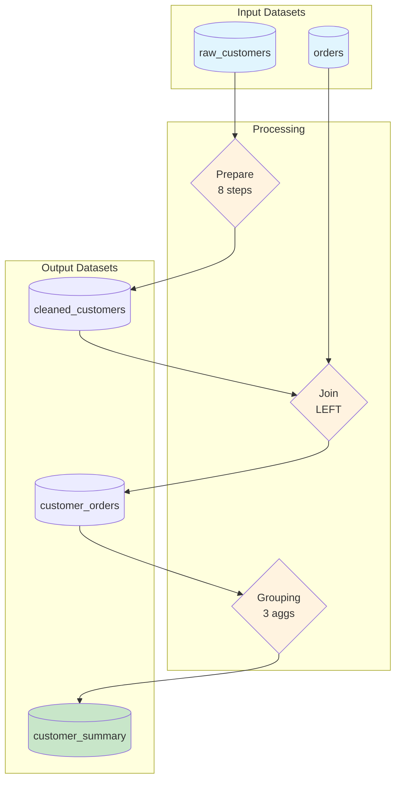

# Prompt: Python-to-Dataiku Converter Library (py2dataiku)

## Project Overview

Build a Python library called `py2dataiku` that analyzes Python data processing code (pandas, numpy, scikit-learn, etc.) and converts it into a structured representation of Dataiku DSS recipes, flows, and configurations. The library should:

1. **Parse Python code** using AST analysis to identify data transformation patterns
2. **Map operations** to equivalent Dataiku visual recipes and processors
3. **Generate flow diagrams** showing the optimal Dataiku pipeline structure
4. **Output recipe configurations** in JSON format matching Dataiku's API schema

---

## Core Architecture

### Module Structure

```
py2dataiku/
├── __init__.py
├── parser/
│   ├── __init__.py
│   ├── ast_analyzer.py        # Python AST parsing and traversal
│   ├── pattern_matcher.py     # Operation pattern recognition
│   ├── dataflow_tracker.py    # Track data lineage through code
│   └── variable_resolver.py   # Resolve variable assignments and transformations
├── mappings/
│   ├── __init__.py
│   ├── pandas_mappings.py     # pandas → Dataiku recipe mappings
│   ├── numpy_mappings.py      # numpy → Dataiku mappings
│   ├── sklearn_mappings.py    # scikit-learn → ML recipe mappings
│   ├── processor_catalog.py   # Complete Dataiku processor type catalog
│   └── recipe_templates.py    # Dataiku recipe JSON templates
├── optimizer/
│   ├── __init__.py
│   ├── recipe_merger.py       # Merge compatible operations into single recipes
│   ├── flow_optimizer.py      # Optimize recipe ordering and parallelization
│   └── processor_orderer.py   # Order prepare recipe steps optimally
├── generators/
│   ├── __init__.py
│   ├── recipe_generator.py    # Generate Dataiku recipe configurations
│   ├── flow_generator.py      # Generate complete flow structure
│   ├── diagram_generator.py   # Generate visual flow diagrams (Mermaid, GraphViz)
│   └── report_generator.py    # Generate human-readable conversion reports
├── models/
│   ├── __init__.py
│   ├── dataiku_flow.py        # Flow data model
│   ├── dataiku_recipe.py      # Recipe data model (all types)
│   ├── dataiku_dataset.py     # Dataset node data model
│   ├── prepare_step.py        # Prepare recipe step/processor model
│   └── transformation.py      # Intermediate transformation representation
└── utils/
    ├── __init__.py
    ├── code_extractor.py      # Extract code from notebooks/scripts
    └── validation.py          # Validate generated configurations
```

---

## Dataiku Recipe Type Mappings

### Visual Recipe Types to Implement

| Dataiku Recipe | Python Pattern | Example Code |
|---------------|----------------|--------------|
| **Prepare** | Column transforms, cleaning | `df['col'].fillna(0)`, `df['col'].str.lower()` |
| **Join** | DataFrame merges | `pd.merge(df1, df2, on='key')`, `df1.join(df2)` |
| **Stack** | Vertical concatenation | `pd.concat([df1, df2])` |
| **Grouping** | Aggregations | `df.groupby('col').agg({'x': 'sum'})` |
| **Window** | Window functions | `df['col'].rolling(7).mean()`, `df.groupby().cumsum()` |
| **Pivot** | Pivot/unpivot | `df.pivot()`, `df.melt()` |
| **Split** | Conditional filtering | `df[df['col'] > 0]`, `df.query()` |
| **Sort** | Sorting | `df.sort_values('col')` |
| **Distinct** | Deduplication | `df.drop_duplicates()` |
| **Top N** | Head/tail selection | `df.head(100)`, `df.nlargest(10, 'col')` |
| **Sampling** | Random sampling | `df.sample(frac=0.1)` |
| **Sync** | Direct copy | `df_copy = df.copy()` |
| **Python Recipe** | Complex logic | Custom functions, ML preprocessing |

### Prepare Recipe Processor Mappings

| Processor Type | Python Pattern | Parameters |
|---------------|----------------|------------|
| `FillEmptyWithValue` | `df['col'].fillna(value)` | `{column, value}` |
| `ColumnRenamer` | `df.rename(columns={...})` | `{renamings: [{from, to}]}` |
| `FilterOnValue` | `df[df['col'] == val]` | `{column, matchingMode, values}` |
| `RemoveRowsOnEmpty` | `df.dropna(subset=['col'])` | `{columns, keep}` |
| `ColumnCopier` | `df['new'] = df['old']` | `{inputColumn, outputColumn}` |
| `ColumnDeleter` | `df.drop(columns=['col'])` | `{columns}` |
| `CreateColumnWithGREL` | `df['new'] = df['a'] + df['b']` | `{column, expression}` |
| `StringTransformer` | `df['col'].str.upper()` | `{column, mode}` |
| `NumericalTransformer` | `df['col'] * 2` | `{column, mode, value}` |
| `DateParser` | `pd.to_datetime(df['col'])` | `{column, formats}` |
| `Tokenizer` | `df['col'].str.split()` | `{column, operation}` |
| `RegexpExtractor` | `df['col'].str.extract(r'...')` | `{column, pattern}` |
| `TypeSetter` | `df['col'].astype(int)` | `{column, type}` |
| `Binner` | `pd.cut(df['col'], bins)` | `{column, mode, bins}` |
| `Normalizer` | `(df['col'] - mean) / std` | `{column, mode}` |
| `MergeLongTailValues` | Value counts threshold | `{column, threshold}` |
| `FlagOnValue` | `df['flag'] = df['col'] == val` | `{column, value, outputColumn}` |
| `SplitColumn` | `df['col'].str.split(',', expand=True)` | `{column, separator}` |
| `ConcatColumns` | `df['a'] + df['b']` | `{columns, outputColumn, separator}` |
| `RoundColumn` | `df['col'].round(2)` | `{column, precision}` |
| `AbsColumn` | `df['col'].abs()` | `{column}` |
| `ClipColumn` | `df['col'].clip(lower, upper)` | `{column, min, max}` |

---

## Key Implementation Requirements

### 1. AST Analysis Engine

```python
class PythonCodeAnalyzer:
    """
    Parse Python code and extract data transformation operations.

    Handles:
    - DataFrame assignments and method chains
    - Variable tracking across statements
    - Function call parameter extraction
    - Control flow (if/else affecting data)
    """

    def analyze(self, code: str) -> List[Transformation]:
        """Extract all transformations from Python code."""
        pass

    def track_dataflow(self, code: str) -> DataFlowGraph:
        """Build a graph of data dependencies."""
        pass

    def resolve_variables(self, code: str) -> Dict[str, DataFrameState]:
        """Track DataFrame state through variable assignments."""
        pass
```

### 2. Pattern Recognition

The library must recognize complex patterns:

```python
# Pattern: Chained operations → Single Prepare recipe with multiple steps
df['name'] = df['name'].str.strip().str.lower()
df['age'] = df['age'].fillna(0).astype(int)
df = df.drop(columns=['unused_col'])

# Should generate:
# Prepare Recipe with steps:
# 1. StringTransformer(column='name', mode='TRIM')
# 2. StringTransformer(column='name', mode='LOWERCASE')
# 3. FillEmptyWithValue(column='age', value=0)
# 4. TypeSetter(column='age', type='int')
# 5. ColumnDeleter(columns=['unused_col'])
```

```python
# Pattern: GroupBy aggregation → Grouping recipe
result = df.groupby(['category', 'region']).agg({
    'sales': 'sum',
    'quantity': 'mean',
    'id': 'count'
}).reset_index()

# Should generate:
# Grouping Recipe:
#   keys: ['category', 'region']
#   aggregations:
#     - column: 'sales', function: 'SUM'
#     - column: 'quantity', function: 'AVG'
#     - column: 'id', function: 'COUNT'
```

```python
# Pattern: Multiple filter conditions → Split recipe OR Prepare FilterOnValue
high_value = df[df['amount'] > 1000]
low_value = df[df['amount'] <= 1000]

# Should generate:
# Split Recipe:
#   condition: amount > 1000
#   outputs: [high_value_dataset, low_value_dataset]
```

```python
# Pattern: Merge/Join → Join recipe
merged = pd.merge(customers, orders,
                  left_on='customer_id',
                  right_on='cust_id',
                  how='left')

# Should generate:
# Join Recipe:
#   type: LEFT
#   left_input: customers
#   right_input: orders
#   join_keys: [{left: 'customer_id', right: 'cust_id'}]
```

### 3. Flow Optimization

```python
class FlowOptimizer:
    """
    Optimize the sequence of Dataiku recipes.

    Rules:
    1. Merge consecutive Prepare operations into single recipe
    2. Push filters/splits early to reduce data volume
    3. Identify parallel branches that can run concurrently
    4. Minimize intermediate dataset materialization
    5. Prefer visual recipes over Python recipes when possible
    """

    def optimize(self, transformations: List[Transformation]) -> DataikuFlow:
        pass

    def merge_prepare_steps(self, steps: List[PrepareStep]) -> List[PrepareStep]:
        """Combine compatible prepare steps and order optimally."""
        pass

    def identify_parallel_branches(self, flow: DataikuFlow) -> List[List[Recipe]]:
        """Find recipe sequences that can run in parallel."""
        pass
```

### 4. Diagram Generation

Generate flow diagrams in multiple formats:

```python
class DiagramGenerator:
    """Generate visual representations of Dataiku flows."""

    def to_mermaid(self, flow: DataikuFlow) -> str:
        """
        Generate Mermaid diagram syntax.

        Example output:
        ```mermaid
        flowchart LR
            A[(raw_data)] --> B{Prepare}
            B --> C[(cleaned_data)]
            C --> D{Join}
            E[(lookup_table)] --> D
            D --> F[(enriched_data)]
            F --> G{Grouping}
            G --> H[(aggregated)]
        ```
        """
        pass

    def to_graphviz(self, flow: DataikuFlow) -> str:
        """Generate GraphViz DOT syntax."""
        pass

    def to_ascii(self, flow: DataikuFlow) -> str:
        """Generate ASCII art diagram for terminal display."""
        pass

    def to_plantuml(self, flow: DataikuFlow) -> str:
        """Generate PlantUML activity diagram."""
        pass

    def save_png(self, flow: DataikuFlow, path: str) -> None:
        """Render and save as PNG image."""
        pass

    def save_svg(self, flow: DataikuFlow, path: str) -> None:
        """Render and save as SVG."""
        pass
```

---

## Output Formats

### 1. Flow Summary Report (YAML)

```yaml
flow_name: "customer_analysis_pipeline"
generated_from: "analysis.py"
generation_timestamp: "2024-01-15T10:30:00Z"
total_recipes: 5
total_datasets: 6

datasets:
  - name: raw_customers
    type: input
    inferred_schema:
      - {name: customer_id, type: string}
      - {name: name, type: string}
      - {name: email, type: string}

  - name: cleaned_customers
    type: intermediate

  - name: customer_segments
    type: output

recipes:
  - name: prepare_customers
    type: Prepare
    input: raw_customers
    output: cleaned_customers
    steps: 8
    step_summary:
      - "Rename columns: cust_id → customer_id"
      - "Trim and lowercase name"
      - "Fill empty emails with 'unknown@example.com'"
      - "Remove rows with null customer_id"

  - name: join_with_orders
    type: Join
    inputs: [cleaned_customers, orders]
    output: customer_orders
    join_type: left
    join_keys: [customer_id]

optimization_notes:
  - "Merged 3 consecutive column transforms into single Prepare recipe"
  - "Moved filter before Join to reduce data volume by ~40%"
  - "Identified 2 parallel branches for concurrent execution"
```

### 2. Recipe Configuration JSON (Dataiku API Compatible)

```json
{
  "type": "prepare",
  "name": "prepare_customers",
  "inputs": [{"ref": "raw_customers"}],
  "outputs": [{"ref": "cleaned_customers"}],
  "settings": {
    "mode": "NORMAL",
    "steps": [
      {
        "metaType": "PROCESSOR",
        "type": "ColumnRenamer",
        "disabled": false,
        "params": {
          "renamings": [
            {"from": "cust_id", "to": "customer_id"},
            {"from": "cust_name", "to": "customer_name"}
          ]
        }
      },
      {
        "metaType": "PROCESSOR",
        "type": "StringTransformer",
        "disabled": false,
        "params": {
          "column": "customer_name",
          "mode": "TRIM"
        }
      },
      {
        "metaType": "PROCESSOR",
        "type": "StringTransformer",
        "disabled": false,
        "params": {
          "column": "customer_name",
          "mode": "LOWERCASE"
        }
      },
      {
        "metaType": "PROCESSOR",
        "type": "FillEmptyWithValue",
        "disabled": false,
        "params": {
          "column": "email",
          "value": "unknown@example.com"
        }
      },
      {
        "metaType": "PROCESSOR",
        "type": "RemoveRowsOnEmpty",
        "disabled": false,
        "params": {
          "columns": ["customer_id"],
          "keep": false
        }
      }
    ]
  }
}
```

### 3. Grouping Recipe Configuration

```json
{
  "type": "grouping",
  "name": "aggregate_orders",
  "inputs": [{"ref": "customer_orders"}],
  "outputs": [{"ref": "customer_summary"}],
  "settings": {
    "keys": [
      {"column": "customer_id"}
    ],
    "aggregations": [
      {
        "column": "order_id",
        "type": "COUNT",
        "outputColumn": "order_count"
      },
      {
        "column": "amount",
        "type": "SUM",
        "outputColumn": "total_amount"
      },
      {
        "column": "amount",
        "type": "AVG",
        "outputColumn": "avg_order_value"
      }
    ],
    "computedColumns": [],
    "globalCount": false,
    "preFilter": {}
  }
}
```

### 4. Join Recipe Configuration

```json
{
  "type": "join",
  "name": "join_customers_orders",
  "inputs": [
    {"ref": "cleaned_customers", "role": "left"},
    {"ref": "orders", "role": "right"}
  ],
  "outputs": [{"ref": "customer_orders"}],
  "settings": {
    "joinType": "LEFT",
    "joins": [
      {
        "left": {"column": "customer_id", "type": "string"},
        "right": {"column": "customer_id", "type": "string"},
        "matchType": "EXACT"
      }
    ],
    "selectedColumns": {
      "left": ["customer_id", "customer_name", "email"],
      "right": ["order_id", "amount", "order_date"]
    },
    "preFilter": {}
  }
}
```

### 5. Visual Flow Diagram (ASCII)

```
┌─────────────────┐     ┌─────────────┐     ┌────────────────────┐
│  raw_customers  │────▶│   Prepare   │────▶│  cleaned_customers │
│    (input)      │     │  (8 steps)  │     │   (intermediate)   │
└─────────────────┘     └─────────────┘     └────────────────────┘
                                                      │
┌─────────────────┐                                   ▼
│     orders      │───────────────────────────▶┌─────────────┐
│    (input)      │                            │    Join     │
└─────────────────┘                            │   (LEFT)    │
                                               └─────────────┘
                                                      │
                                                      ▼
                                            ┌────────────────────┐
                                            │   customer_orders  │
                                            │   (intermediate)   │
                                            └────────────────────┘
                                                      │
                                                      ▼
                                               ┌─────────────┐     ┌──────────────────┐
                                               │  Grouping   │────▶│ customer_summary │
                                               │  (3 aggs)   │     │    (output)      │
                                               └─────────────┘     └──────────────────┘
```

### 6. Mermaid Diagram



---

## Example Usage

### Basic Usage

```python
from py2dataiku import CodeAnalyzer, FlowGenerator, DiagramGenerator

# Analyze Python code
code = """
import pandas as pd

# Load data
df = pd.read_csv('customers.csv')

# Clean data
df['name'] = df['name'].str.strip().str.title()
df['email'] = df['email'].str.lower()
df = df.dropna(subset=['customer_id'])
df = df.drop_duplicates(subset=['customer_id'])

# Join with orders
orders = pd.read_csv('orders.csv')
merged = pd.merge(df, orders, on='customer_id', how='left')

# Aggregate
summary = merged.groupby('customer_id').agg({
    'order_id': 'count',
    'amount': 'sum'
}).reset_index()
summary.columns = ['customer_id', 'order_count', 'total_amount']

# Filter high-value customers
high_value = summary[summary['total_amount'] > 1000]
"""

# Generate Dataiku flow
analyzer = CodeAnalyzer()
transformations = analyzer.analyze(code)

generator = FlowGenerator()
flow = generator.generate(transformations)

# Output results
print(flow.to_yaml())           # YAML summary
print(flow.to_json())           # Dataiku API-compatible JSON
print(flow.to_recipe_configs()) # Individual recipe configurations

# Generate diagrams
diagram = DiagramGenerator()
print(diagram.to_mermaid(flow))
print(diagram.to_ascii(flow))

# Save diagram as image
diagram.save_png(flow, 'dataiku_flow.png')
```

### Jupyter Notebook Support

```python
from py2dataiku import NotebookAnalyzer

# Analyze entire notebook
analyzer = NotebookAnalyzer()
flow = analyzer.analyze_notebook('analysis.ipynb')

# Analyze specific cells
flow = analyzer.analyze_cells('analysis.ipynb', cells=[1, 2, 5, 7])

# Get cell-by-cell breakdown
report = analyzer.get_cell_mapping('analysis.ipynb')
for cell_num, recipes in report.items():
    print(f"Cell {cell_num}: {[r.name for r in recipes]}")
```

### Interactive Mode

```python
from py2dataiku import InteractiveConverter

converter = InteractiveConverter()

# Add transformations incrementally
converter.add_code("df = pd.read_csv('data.csv')")
converter.add_code("df['col'] = df['col'].fillna(0)")
converter.add_code("df = df.drop_duplicates()")

# Preview current flow
print(converter.preview_flow())

# Get recommendations
print(converter.get_recommendations())

# Finalize and export
flow = converter.finalize()
flow.export_all('output_directory/')
```

### CLI Usage

```bash
# Convert a Python script
py2dataiku convert script.py --output flow.yaml --diagram flow.png

# Convert a Jupyter notebook
py2dataiku convert notebook.ipynb --format json --output recipes/

# Preview without saving
py2dataiku preview script.py --ascii

# Generate only diagrams
py2dataiku diagram script.py --format mermaid --output flow.md
```

---

## Advanced Features

### 1. Scikit-learn Pipeline Conversion

Convert sklearn pipelines to Dataiku ML recipes:

```python
from sklearn.pipeline import Pipeline
from sklearn.preprocessing import StandardScaler, OneHotEncoder
from sklearn.compose import ColumnTransformer
from sklearn.ensemble import RandomForestClassifier

# Define preprocessing
numeric_transformer = Pipeline([
    ('scaler', StandardScaler())
])

categorical_transformer = Pipeline([
    ('encoder', OneHotEncoder(handle_unknown='ignore'))
])

preprocessor = ColumnTransformer([
    ('num', numeric_transformer, ['age', 'income']),
    ('cat', categorical_transformer, ['category', 'region'])
])

pipeline = Pipeline([
    ('preprocessor', preprocessor),
    ('classifier', RandomForestClassifier(n_estimators=100))
])

# Should map to:
# 1. Prepare recipe: Normalizer processors for numeric columns
# 2. Prepare recipe: CreateColumnWithGREL for one-hot encoding (or use Pivot)
# 3. Visual ML Training recipe with Random Forest algorithm
```

### 2. Optimization Recommendations

```python
recommendations = flow.get_recommendations()

# Output:
# [
#   {
#     "type": "PERFORMANCE",
#     "priority": "HIGH",
#     "message": "Filter on 'status' column could be moved before Join",
#     "impact": "Reduces Join input by ~40%",
#     "action": "Move filter to line 15 before merge on line 20"
#   },
#   {
#     "type": "RECIPE_CHOICE",
#     "priority": "MEDIUM",
#     "message": "Consider Fuzzy Join instead of exact Join on 'company_name'",
#     "impact": "May improve match rate for similar company names",
#     "action": "Review if approximate matching is acceptable"
#   },
#   {
#     "type": "CONSOLIDATION",
#     "priority": "LOW",
#     "message": "3 separate filter operations could be combined",
#     "impact": "Reduces recipe count from 3 to 1",
#     "action": "Merge filters into single Prepare recipe with FilterOnValue"
#   }
# ]
```

### 3. Column Lineage Tracking

```python
lineage = flow.get_column_lineage('total_amount')

# Output:
# {
#   "column": "total_amount",
#   "final_dataset": "customer_summary",
#   "origin": {
#     "dataset": "orders",
#     "column": "amount"
#   },
#   "transformations": [
#     {
#       "recipe": "join_customers_orders",
#       "type": "PASSTHROUGH",
#       "description": "Column passed through Join"
#     },
#     {
#       "recipe": "aggregate_orders",
#       "type": "AGGREGATION",
#       "function": "SUM",
#       "description": "Summed in Grouping recipe"
#     }
#   ]
# }
```

### 4. Schema Inference

```python
schema = flow.infer_schema('cleaned_customers')

# Output:
# {
#   "dataset": "cleaned_customers",
#   "columns": [
#     {"name": "customer_id", "type": "string", "nullable": false},
#     {"name": "customer_name", "type": "string", "nullable": true},
#     {"name": "email", "type": "string", "nullable": true, "default": "unknown@example.com"},
#     {"name": "signup_date", "type": "date", "format": "yyyy-MM-dd"}
#   ],
#   "estimated_row_count": "unknown",
#   "notes": [
#     "customer_id made non-nullable by RemoveRowsOnEmpty step",
#     "email default value inferred from FillEmptyWithValue step"
#   ]
# }
```

### 5. Validation and Warnings

```python
validation = flow.validate()

# Output:
# {
#   "valid": true,
#   "errors": [],
#   "warnings": [
#     {
#       "type": "AMBIGUOUS_COLUMN",
#       "message": "Column 'id' exists in both inputs to Join",
#       "suggestion": "Specify column selection or rename before Join"
#     },
#     {
#       "type": "POTENTIAL_DATA_LOSS",
#       "message": "LEFT Join may produce null values in columns from 'orders'",
#       "suggestion": "Consider adding FillEmptyWithValue after Join"
#     }
#   ],
#   "info": [
#     {
#       "type": "PYTHON_FALLBACK",
#       "message": "Custom function 'calculate_score()' requires Python recipe",
#       "lines": [45, 46, 47]
#     }
#   ]
# }
```

---

## Testing Strategy

### Unit Tests

```python
# Test pattern matching
def test_fillna_pattern():
    code = "df['col'] = df['col'].fillna(0)"
    result = pattern_matcher.match(code)
    assert result.processor_type == 'FillEmptyWithValue'
    assert result.params == {'column': 'col', 'value': 0}

def test_groupby_pattern():
    code = "df.groupby('cat').agg({'val': 'sum'})"
    result = pattern_matcher.match(code)
    assert result.recipe_type == 'Grouping'
    assert result.keys == ['cat']
    assert result.aggregations == [{'column': 'val', 'function': 'SUM'}]

# Test recipe generation
def test_prepare_recipe_generation():
    steps = [
        PrepareStep('FillEmptyWithValue', {'column': 'a', 'value': 0}),
        PrepareStep('StringTransformer', {'column': 'b', 'mode': 'TRIM'})
    ]
    recipe = recipe_generator.generate_prepare(steps, 'input', 'output')
    assert recipe['type'] == 'prepare'
    assert len(recipe['settings']['steps']) == 2

# Test flow optimization
def test_merge_consecutive_prepare():
    flow = FlowOptimizer()
    # Given: Prepare1 → Dataset1 → Prepare2 → Dataset2
    # Expected: Prepare(combined) → Dataset2
    optimized = flow.optimize(input_flow)
    assert len([r for r in optimized.recipes if r.type == 'prepare']) == 1
```

### Integration Tests

```python
def test_end_to_end_simple_pipeline():
    code = """
    df = pd.read_csv('input.csv')
    df['col'] = df['col'].fillna(0)
    df.to_csv('output.csv')
    """
    flow = convert(code)
    assert len(flow.datasets) == 2
    assert len(flow.recipes) == 1
    assert flow.recipes[0].type == 'prepare'

def test_complex_pipeline_with_join():
    code = """
    customers = pd.read_csv('customers.csv')
    orders = pd.read_csv('orders.csv')
    merged = pd.merge(customers, orders, on='id')
    summary = merged.groupby('region').agg({'amount': 'sum'})
    """
    flow = convert(code)
    assert 'join' in [r.type for r in flow.recipes]
    assert 'grouping' in [r.type for r in flow.recipes]
```

### Validation Tests

```python
def test_json_schema_compliance():
    flow = convert(sample_code)
    for recipe in flow.recipes:
        config = recipe.to_json()
        # Validate against Dataiku API schema
        assert validate_dataiku_schema(config)

def test_diagram_generation():
    flow = convert(sample_code)
    mermaid = DiagramGenerator().to_mermaid(flow)
    # Should be valid Mermaid syntax
    assert 'flowchart' in mermaid
    assert '[(dataset)]' in mermaid or '[(' in mermaid
```

---

## Dependencies

```toml
[project]
name = "py2dataiku"
version = "0.1.0"
requires-python = ">=3.9"

dependencies = [
    "pandas>=1.5.0",
    "numpy>=1.21.0",
    "pyyaml>=6.0",
    "graphviz>=0.20",
    "astor>=0.8.1",      # AST manipulation
    "networkx>=3.0",      # Graph operations for flow
]

[project.optional-dependencies]
dev = [
    "pytest>=7.0",
    "pytest-cov>=4.0",
    "black>=23.0",
    "mypy>=1.0",
]
notebooks = [
    "nbformat>=5.7",      # Jupyter notebook parsing
]
diagrams = [
    "pillow>=9.0",        # Image generation
    "cairosvg>=2.7",      # SVG rendering
]
```

---

## Key Challenges to Address

1. **Complex Method Chains**: Handle deeply nested pandas method chains like `df.col.str.strip().str.lower().str.replace(...)`

2. **Variable Aliasing**: Track DataFrame references across variable assignments and function returns

3. **Control Flow**: Handle conditional transformations (`if`/`else` blocks) - may require Python recipe fallback

4. **Custom Functions**: Identify when Python recipe is needed vs. visual recipe (UDFs, complex logic)

5. **Ambiguous Mappings**: When multiple Dataiku approaches are valid, choose optimal based on:
   - Performance (prefer visual recipes)
   - Maintainability (fewer recipes is better)
   - Dataiku best practices

6. **Incomplete Code**: Handle scripts that reference external data sources, imports, or undefined variables

7. **Order of Operations**: Ensure Prepare recipe steps are ordered correctly (e.g., type conversion before numeric operations)

8. **Multi-output Operations**: Handle operations like `train_test_split()` that produce multiple outputs

---

## Success Criteria

1. Accurately parse 90%+ of common pandas operations
2. Generate valid Dataiku recipe configurations (JSON schema compliant)
3. Produce clear, readable flow diagrams in multiple formats
4. Provide actionable optimization recommendations
5. Support both Python scripts and Jupyter notebooks
6. Handle edge cases gracefully with clear fallback to Python recipes
7. Comprehensive test coverage (>80%)
8. Well-documented API with examples

---

## References

- [Dataiku Developer Guide - Recipes](https://developer.dataiku.com/latest/concepts-and-examples/recipes.html)
- [Visual Recipes Documentation](https://doc.dataiku.com/dss/latest/other_recipes/index.html)
- [Python Recipes Documentation](https://doc.dataiku.com/dss/latest/code_recipes/python.html)
- [The Flow - Dataiku DSS 14](https://doc.dataiku.com/dss/latest/flow/index.html)
- [Exporting Flow to PDF/Images](https://doc.dataiku.com/dss/latest/flow/graphics-export.html)
- [Prepare Recipe Processors - Aimpoint Digital](https://www.aimpointdigital.com/blog/dataikus-prepare-recipe-processor)
- [Flow Creation and Management](https://developer.dataiku.com/latest/concepts-and-examples/flow.html)
- [Dataiku API Client Python](https://github.com/dataiku/dataiku-api-client-python)
