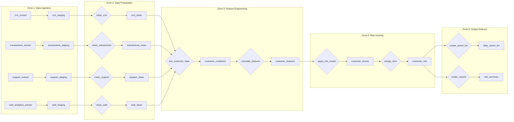

# Sample Flow Documentation

> **Note**: This is an example of completed flow documentation to demonstrate proper documentation style.

---

# Customer Churn Prediction - Flow Documentation (Sample)

**Last Updated**: 2024-01-15
**Document Owner**: Marketing Analytics Team

---

## Flow Overview

### High-Level Flow (Bird's Eye View)

```
┌─────────────────┐     ┌─────────────────┐     ┌─────────────────┐
│     INPUTS      │     │   PROCESSING    │     │    OUTPUTS      │
│                 │     │                 │     │                 │
│ • CRM Data      │────▶│ • Ingestion     │────▶│ • Risk Scores   │
│ • Transactions  │     │ • Preparation   │     │ • Action List   │
│ • Support Data  │     │ • Scoring       │     │ • Reports       │
│ • Web Analytics │     │ • Segmentation  │     │                 │
└─────────────────┘     └─────────────────┘     └─────────────────┘
```

### Zone Overview

| Zone | Purpose | Input From | Output To |
|------|---------|------------|-----------|
| Data Ingestion | Bring source data into project | External systems | Data Preparation |
| Data Preparation | Clean and standardize data | Data Ingestion | Feature Engineering |
| Feature Engineering | Calculate engagement metrics | Data Preparation | Risk Scoring |
| Risk Scoring | Apply risk model | Feature Engineering | Output Delivery |
| Output Delivery | Format and deliver results | Risk Scoring | Consumers |

---

## Detailed Flow Diagram



---

## Zone 1: Data Ingestion

### Purpose

Bring raw data from source systems into the Dataiku project in a consistent format, establishing a clean boundary between external systems and our processing logic.

### What Happens Here

Each source system's data is extracted and loaded into staging datasets. No transformations occur here - this zone simply establishes reliable copies of source data within the project.

### Datasets in This Zone

| Dataset | Role | Description |
|---------|------|-------------|
| crm_extract | Input | Raw customer profile data from CRM |
| transactions_extract | Input | Raw purchase transaction data |
| support_extract | Input | Raw support ticket data |
| web_analytics_extract | Input | Raw website behavior data |
| crm_staging | Intermediate | Staged CRM data |
| transactions_staging | Intermediate | Staged transaction data |
| support_staging | Intermediate | Staged support data |
| web_staging | Intermediate | Staged web data |

### Recipes in This Zone

| Recipe | Type | Input(s) | Output(s) | Purpose |
|--------|------|----------|-----------|---------|
| sync_crm | Sync | crm_extract | crm_staging | Create local copy of CRM data |
| sync_transactions | Sync | transactions_extract | transactions_staging | Create local copy of transaction data |
| sync_support | Sync | support_extract | support_staging | Create local copy of support data |
| sync_web | Sync | web_analytics_extract | web_staging | Create local copy of web data |

### What Could Go Wrong

| Failure Mode | Symptoms | Likely Cause | Resolution |
|--------------|----------|--------------|------------|
| Source unavailable | Job fails immediately | Source system down/maintenance | Wait for source recovery |
| Schema change | Column not found error | Source added/removed fields | Update sync to handle new schema |
| Connection timeout | Timeout error in logs | Network issues | Check connectivity, retry |

---

## Zone 2: Data Preparation

### Purpose

Clean, standardize, and validate source data to ensure consistent quality for downstream processing. This zone handles data quality issues at the source before they propagate.

### What Happens Here

Each data source is cleaned independently:
- Invalid or malformed records are flagged or removed
- Fields are standardized to consistent formats
- Data types are normalized
- Quality checks are applied

### Step-by-Step Flow

```
┌─────────────────────────────────────────────────────────────────┐
│ STEP 1: Standardize formats                                     │
│   Input: Raw staged data                                        │
│   Process: Normalize dates, fix encoding, trim whitespace       │
│   Output: Format-standardized data                              │
│   Record Flow: SAME (no records removed)                        │
├─────────────────────────────────────────────────────────────────┤
│ STEP 2: Validate data quality                                   │
│   Input: Format-standardized data                               │
│   Process: Check required fields, validate ranges               │
│   Output: Validated data with quality flags                     │
│   Record Flow: SAME (flags added, no records removed)           │
├─────────────────────────────────────────────────────────────────┤
│ STEP 3: Remove invalid records                                  │
│   Input: Validated data                                         │
│   Process: Filter out records failing critical quality checks   │
│   Output: Clean data ready for processing                       │
│   Record Flow: FEWER (invalid records removed)                  │
└─────────────────────────────────────────────────────────────────┘
```

### Business Rules Applied

- **DQ-001**: Records with missing customer_id are excluded
- **DQ-002**: Transaction amounts must be positive
- **DQ-003**: Dates must be within valid range

---

## Zone 3: Feature Engineering

### Purpose

Combine cleaned data sources and calculate the engagement features needed for risk scoring. This zone transforms raw data into meaningful business metrics.

### What Happens Here

1. All customer-related data is joined into a single customer view
2. Engagement metrics are calculated (recency, frequency, trends)
3. Support sentiment is derived from ticket data
4. Web engagement signals are computed

### Key Transformations

| Transformation | Plain Language Explanation |
|----------------|---------------------------|
| Customer Join | Bring together profile, transaction, support, and web data for each customer |
| Recency Calculation | How recently did this customer engage with us? |
| Frequency Calculation | How often does this customer engage? |
| Trend Detection | Is engagement increasing, stable, or declining? |
| Sentiment Derivation | Are support interactions positive or negative? |

### Business Rules Applied

| Rule ID | Rule Name | How Applied |
|---------|-----------|-------------|
| BR-001 | Customer Activity Classification | Applied after feature calculation to assign engagement level |

### Data Flow

```
[crm_clean] ─────┐
                 │
[transactions_   ├──► [customer_combined] ──► [customer_features]
 clean] ─────────┤
                 │    Join on                  Calculate
[support_clean] ─┤    customer_id              engagement
                 │                             metrics
[web_clean] ─────┘
```

---

## Zone 4: Risk Scoring

### Purpose

Apply the risk model to calculate churn probability and assign actionable risk tiers.

### What Happens Here

1. Risk score calculated from engagement features
2. Score converted to risk tier (Critical/High/Medium/Low)
3. Primary risk factors identified for each customer

### Decision Points

```
                         ┌──────────────────┐
                         │ Customer with    │
                         │ features received│
                         └────────┬─────────┘
                                  │
                         ┌────────▼─────────┐
                         │ Calculate risk   │
                         │ score (BR-002)   │
                         └────────┬─────────┘
                                  │
                         ┌────────▼─────────┐
                         │ Assign tier      │
                         │ (BR-003)         │
                         └────────┬─────────┘
                                  │
               ┌──────────────────┼──────────────────┐
               │                  │                  │
         ┌─────▼─────┐      ┌─────▼─────┐     ┌─────▼─────┐
         │ CRITICAL  │      │   HIGH    │     │ MED/LOW   │
         │ Immediate │      │ 24hr      │     │ Standard  │
         │ escalation│      │ outreach  │     │ monitoring│
         └───────────┘      └───────────┘     └───────────┘
```

### Business Rules Applied

| Rule ID | Rule Name | Effect |
|---------|-----------|--------|
| BR-002 | Risk Score Calculation | Produces numeric risk score |
| BR-003 | Risk Tier Assignment | Converts score to tier |

---

## Zone 5: Output Delivery

### Purpose

Format risk data into consumable outputs for different audiences and deliver to appropriate destinations.

### Outputs Produced

| Output | Destination | Format | Frequency | Consumer |
|--------|-------------|--------|-----------|----------|
| daily_action_list | [EXPORT_LOCATION] | CSV | Daily by 7 AM | Customer Success |
| risk_summary | [DASHBOARD] | Dashboard | Daily by 7 AM | Leadership |
| customer_risk | Internal | Dataset | Daily | Analytics |

### Business Rules Applied

| Rule ID | Rule Name | Effect |
|---------|-----------|--------|
| BR-004 | Action Priority Assignment | Ranks customers within each tier |

---

## Cross-Zone Data Lineage

### Field: risk_tier (Critical Output Field)

```
[daily_action_list].risk_tier
  ↑ copied from: [customer_risk].risk_tier
    ↑ derived in: assign_tiers recipe (Zone 4)
      ↑ based on: risk_score (from BR-003)
        ↑ calculated in: apply_risk_model recipe (Zone 4)
          ↑ based on: engagement features (Zone 3)
            ↑ derived from: combined customer data
              ↑ sourced from: crm, transactions, support, web (Zone 1)
```

### Field: engagement_level

```
[customer_features].engagement_level
  ↑ derived in: calculate_features recipe (Zone 3, Step 4)
    ↑ based on: BR-001 rules using:
      - last_activity_date (from crm_clean)
      - interaction_count (calculated from transactions)
      - days_since_activity (calculated)
```

---

## Execution Order

### Normal Execution Sequence

```
Zone 1: Ingestion (parallel)
├── sync_crm
├── sync_transactions
├── sync_support
└── sync_web
        │
        ▼
Zone 2: Preparation (parallel)
├── clean_crm
├── clean_transactions
├── clean_support
└── clean_web
        │
        ▼
Zone 3: Features (sequential)
├── join_customer_data
└── calculate_features
        │
        ▼
Zone 4: Scoring (sequential)
├── apply_risk_model
└── assign_tiers
        │
        ▼
Zone 5: Output (parallel)
├── create_action_list
└── create_reports
```

### Total Runtime: ~45 minutes

| Zone | Typical Duration |
|------|-----------------|
| Zone 1: Ingestion | 10 min |
| Zone 2: Preparation | 10 min |
| Zone 3: Features | 15 min |
| Zone 4: Scoring | 5 min |
| Zone 5: Output | 5 min |
