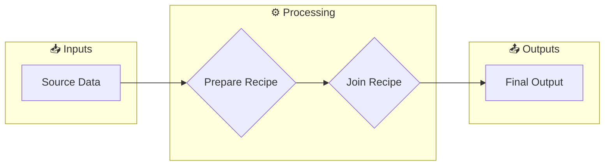

# Visual Vocabulary: Understanding Dataiku DSS Icons and Symbols

This guide explains the visual elements you'll see in Dataiku DSS so you can quickly understand any project's flow.

---

## Dataset Icons

### By Storage Type

| Icon | Name | Description |
|------|------|-------------|
| 📁 | Files | CSV, Excel, Parquet, JSON files stored locally or in cloud storage |
| 🗄️ | SQL Database | Data stored in relational databases (PostgreSQL, MySQL, etc.) |
| ☁️ | Cloud Storage | S3, Azure Blob, Google Cloud Storage |
| 🌐 | External | Data from APIs or external connections |
| 📊 | Managed | Dataiku-managed datasets (internal storage) |

### By Role in Flow

| Visual | Meaning | Description |
|--------|---------|-------------|
| **Blue border** | Input | Data entering the project from external sources |
| **Green border** | Output | Final deliverables consumed by users/systems |
| **Gray border** | Intermediate | Working datasets between transformations |

### Dataset States

| Indicator | Meaning |
|-----------|---------|
| ✓ Green check | Data is built and up-to-date |
| ⚠️ Yellow warning | Data may be stale or has warnings |
| ❌ Red X | Data is not built or build failed |
| 🔄 Blue arrows | Build in progress |
| ⏸️ Gray | No data (empty or not built) |

---

## Recipe Icons

### Visual Recipes (No Coding Required)

| Icon | Recipe Type | What It Does | Plain Language |
|------|-------------|--------------|----------------|
| 🔧 | **Prepare** | Data transformation | "Clean, modify, and transform data step by step" |
| 🔗 | **Join** | Combine datasets | "Match records from different datasets based on common fields" |
| 📚 | **Stack** | Union datasets | "Pile datasets on top of each other (same columns)" |
| ✂️ | **Split** | Divide by condition | "Send different records to different outputs based on rules" |
| 📊 | **Group** | Aggregate data | "Summarize data - count, sum, average by categories" |
| 🪟 | **Window** | Rolling calculations | "Calculate over sliding windows (running totals, moving averages)" |
| 🔄 | **Pivot** | Reshape data | "Turn rows into columns (spreadsheet pivot table)" |
| ↕️ | **Sort** | Order records | "Arrange records in specific order" |
| 🎯 | **Distinct** | Remove duplicates | "Keep only unique records" |
| 🔝 | **Top N** | Filter to top records | "Keep only the top/bottom records by some measure" |
| 🎲 | **Sample** | Reduce data size | "Take a representative subset of records" |
| 🔁 | **Sync** | Copy data | "Copy data from one place to another" |

### Code Recipes

| Icon | Recipe Type | What It Does |
|------|-------------|--------------|
| 🐍 | **Python** | Custom Python code transformation |
| 📘 | **R** | Custom R code transformation |
| 🗃️ | **SQL** | Custom SQL query |
| ⚡ | **PySpark** | Python code running on Spark cluster |
| 💾 | **SQL Query** | In-database SQL transformation |
| 🐚 | **Shell** | Command-line scripts |

### Machine Learning Recipes

| Icon | Recipe Type | What It Does |
|------|-------------|--------------|
| 🤖 | **Train** | Build a prediction model |
| 📈 | **Score** | Apply model to new data |
| 📉 | **Evaluate** | Measure model performance |
| 🎯 | **Clustering** | Group similar records |

---

## Recipe Visual States

### Recipe Status Indicators

| Visual | Meaning | Action |
|--------|---------|--------|
| ✓ Green | Outputs up-to-date | No action needed |
| 🟡 Yellow | Outputs may be stale | Consider rebuilding |
| 🔴 Red | Build failed | Check logs, fix issue |
| ⚪ Gray | Never built | Build when ready |
| 🔵 Blue pulse | Currently building | Wait for completion |

### Recipe Connections

```
Dataset ──────────► Recipe ──────────► Dataset
   │                  │                  │
   │                  │                  │
Input              Process            Output
connection         step               connection
```

**Arrow meanings:**
- **Solid line**: Primary input/output
- **Dashed line**: Optional or conditional input
- **Multiple inputs**: Recipe combines multiple data sources
- **Multiple outputs**: Recipe creates multiple results (e.g., Split recipe)

---

## Flow Layout Concepts

### Zones

```
┌─────────────────────────────────────────────────────┐
│                     ZONE NAME                        │
│  ┌─────┐    ┌─────┐    ┌─────┐                      │
│  │ DS1 │───▶│ R1  │───▶│ DS2 │                      │
│  └─────┘    └─────┘    └─────┘                      │
│                                                      │
│  Zones group related datasets and recipes together   │
└─────────────────────────────────────────────────────┘
```

**Common zone patterns:**
- **Ingestion Zone**: Where data enters
- **Preparation Zone**: Where data is cleaned
- **Business Logic Zone**: Where rules are applied
- **Output Zone**: Where results are delivered

### Flow Direction

```
Left ────────────────────────────────────────► Right

Raw Data          Transformations            Final Outputs
(Sources)         (Recipes)                  (Deliverables)
```

Standard flow reads **left to right**, like reading text:
- Sources on the LEFT
- Transformations in the MIDDLE
- Outputs on the RIGHT

---

## Understanding Prepare Recipe Steps

### Common Processor Icons

| Icon/Name | What It Does | Example Use |
|-----------|--------------|-------------|
| **Rename** | Change column name | "customer_id" → "CustomerID" |
| **Delete** | Remove column | Remove temporary calculation columns |
| **Filter** | Remove rows | Keep only active customers |
| **Formula** | Calculate new values | profit = revenue - cost |
| **Find/Replace** | Change values | "NY" → "New York" |
| **Fill Empty** | Handle missing data | Replace blanks with "Unknown" |
| **Convert Type** | Change data type | Text "123" → Number 123 |
| **Split Column** | Divide one column | "John Smith" → "John", "Smith" |
| **Concatenate** | Combine columns | "John" + "Smith" → "John Smith" |
| **Date Parse** | Extract date parts | "2024-01-15" → Year: 2024, Month: 1 |

### Step Organization

```
┌────────────────────────────────────────┐
│          PREPARE RECIPE                │
├────────────────────────────────────────┤
│ Step 1: [action] ──── [columns affected]│
│ Step 2: [action] ──── [columns affected]│
│ Step 3: [action] ──── [columns affected]│
│ ...                                     │
│ Steps execute top to bottom             │
└────────────────────────────────────────┘
```

---

## Scenario Visual Elements

### Scenario Types

| Icon | Type | Description |
|------|------|-------------|
| ⏰ | Time-based | Runs on schedule (daily, hourly, etc.) |
| 🔗 | Triggered | Runs when something else completes |
| 🖱️ | Manual | Runs only when someone clicks "Run" |

### Scenario Steps

```
┌─────────────────────────────────────┐
│           SCENARIO: daily_run        │
├─────────────────────────────────────┤
│ Step 1: Build dataset_a              │
│    ↓                                 │
│ Step 2: Build dataset_b              │
│    ↓                                 │
│ Step 3: Run Python script            │
│    ↓                                 │
│ Step 4: Send notification            │
└─────────────────────────────────────┘
```

### Scenario Status

| Status | Visual | Meaning |
|--------|--------|---------|
| Success | ✅ Green | All steps completed |
| Failed | ❌ Red | One or more steps failed |
| Running | 🔵 Blue | Currently executing |
| Aborted | ⚪ Gray | Stopped before completion |

---

## Job Indicators

### Job Log Colors

| Color | Meaning |
|-------|---------|
| 🟢 Green | Success - completed normally |
| 🔴 Red | Failed - error occurred |
| 🟡 Yellow | Warning - completed with issues |
| 🔵 Blue | Running - in progress |
| ⚪ Gray | Queued - waiting to start |

### Job Timeline

```
[Start] ───────────────────────────────────► [End]
   │                                            │
   ├── Init (setup)                             │
   ├── Read (load input data)                   │
   ├── Process (transform)                      │
   └── Write (save output)                    Done
```

---

## Data Quality Indicators

| Indicator | Meaning |
|-----------|---------|
| ✓ All green | Data passes all quality rules |
| ⚠️ Yellow flags | Some quality warnings |
| ❌ Red flags | Quality rules violated |
| 📊 Metrics | Click to see quality statistics |

---

## Quick Recognition Guide

### "What am I looking at?"

```
┌──────────────────────────────────────────────────────────┐
│                                                          │
│   [Blue Box]     →    Probably a dataset (data)         │
│                                                          │
│   [Orange/Yellow Box] →  Probably a recipe (process)    │
│                                                          │
│   [Arrow/Line]   →    Shows data flowing from A to B    │
│                                                          │
│   [Dashed Box]   →    A zone (logical grouping)         │
│                                                          │
│   [Colored dot]  →    Status indicator (check legend)   │
│                                                          │
└──────────────────────────────────────────────────────────┘
```

### Color Quick Reference

| Color | Generally Means |
|-------|-----------------|
| **Green** | Good / Success / Up-to-date |
| **Yellow** | Warning / May need attention |
| **Red** | Error / Failed / Problem |
| **Blue** | In progress / Information |
| **Gray** | Inactive / Not built / Unknown |

---

## Annotating Your Own Diagrams

When creating documentation, use consistent symbols:

### Recommended ASCII Symbols

```
Datasets:        [Dataset Name]
Recipes:         {Recipe Name}
Flow:            ────►
Optional flow:   - - -►
Multiple inputs: ┬
Multiple outputs:┴
Zone:            ┌─────────┐
                 │  Zone   │
                 └─────────┘
```

### Mermaid Diagram Conventions



Use:
- `[Square brackets]` for datasets
- `{Curly braces}` for recipes
- Emojis for quick visual scanning
- Subgraphs for zones
