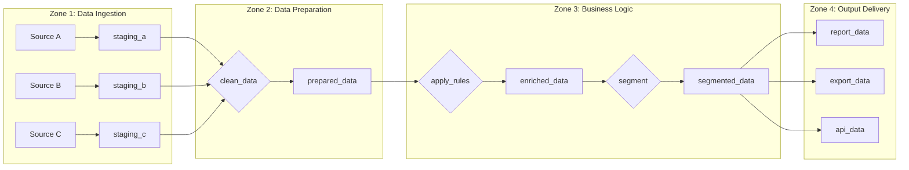

# Flow Documentation Template

> **How to use this template**: Document each section of your data pipeline flow. Create one section document for each major zone or logical grouping in your project.

---

# [PROJECT_NAME] - Flow Documentation

**Last Updated**: [DATE]
**Document Owner**: [ROLE]

---

## Flow Overview

### High-Level Flow (Bird's Eye View)

```
┌─────────────────┐     ┌─────────────────┐     ┌─────────────────┐
│     INPUTS      │     │   PROCESSING    │     │    OUTPUTS      │
│                 │     │                 │     │                 │
│ • [Source 1]    │────▶│ • [Zone 1]      │────▶│ • [Output 1]    │
│ • [Source 2]    │     │ • [Zone 2]      │     │ • [Output 2]    │
│ • [Source 3]    │     │ • [Zone 3]      │     │ • [Output 3]    │
│                 │     │                 │     │                 │
└─────────────────┘     └─────────────────┘     └─────────────────┘
```

### Zone Overview

| Zone | Purpose | Input From | Output To |
|------|---------|------------|-----------|
| [Zone 1 Name] | [Brief purpose] | External sources | Zone 2 |
| [Zone 2 Name] | [Brief purpose] | Zone 1 | Zone 3 |
| [Zone 3 Name] | [Brief purpose] | Zone 2 | External consumers |

---

## Detailed Flow Diagram



---

## Zone 1: [Zone Name - e.g., "Data Ingestion"]

### Purpose

[2-3 sentences explaining WHY this zone exists and WHAT business need it serves]

### What Happens Here

[Plain language explanation of the data transformations in this zone]

### Datasets in This Zone

| Dataset | Role | Description |
|---------|------|-------------|
| [dataset_1] | Input | [What this data is] |
| [dataset_2] | Output | [What this data becomes] |

### Recipes in This Zone

| Recipe | Type | Input(s) | Output(s) | Purpose |
|--------|------|----------|-----------|---------|
| [recipe_1] | [type] | [inputs] | [outputs] | [plain language purpose] |
| [recipe_2] | [type] | [inputs] | [outputs] | [plain language purpose] |

### Step-by-Step Flow

```
┌─────────────────────────────────────────────────────────────────┐
│ STEP 1: [Action in plain language]                              │
│   Input: [what comes in]                                        │
│   Process: [what happens]                                       │
│   Output: [what comes out]                                      │
│   Record Flow: [MANY → SAME/FEWER/MORE] because [reason]        │
├─────────────────────────────────────────────────────────────────┤
│ STEP 2: [Action in plain language]                              │
│   Input: [output from step 1]                                   │
│   Process: [what happens]                                       │
│   Output: [what comes out]                                      │
│   Record Flow: [description]                                    │
├─────────────────────────────────────────────────────────────────┤
│ STEP 3: [Action in plain language]                              │
│   ...                                                           │
└─────────────────────────────────────────────────────────────────┘
```

### Data Transformations Summary

| What Changes | From | To | Why |
|--------------|------|-----|-----|
| [transformation 1] | [before] | [after] | [business reason] |
| [transformation 2] | [before] | [after] | [business reason] |

### Business Rules Applied

- **BR-XXX**: [Brief description of how rule is applied]
- **BR-YYY**: [Brief description of how rule is applied]

### What Could Go Wrong

| Failure Mode | Symptoms | Likely Cause | Resolution |
|--------------|----------|--------------|------------|
| [failure 1] | [what you'd notice] | [common cause] | [how to fix] |
| [failure 2] | [what you'd notice] | [common cause] | [how to fix] |

### Dependencies

**Upstream:**
- Depends on [system/dataset] being available
- Requires [condition] to be true

**Downstream:**
- [Zone/process] depends on this zone completing

---

## Zone 2: [Zone Name - e.g., "Data Preparation"]

### Purpose

[2-3 sentences explaining WHY this zone exists]

### What Happens Here

[Plain language explanation]

### Datasets in This Zone

| Dataset | Role | Description |
|---------|------|-------------|
| [dataset_1] | Input | [description] |
| [dataset_2] | Output | [description] |

### Recipes in This Zone

| Recipe | Type | Input(s) | Output(s) | Purpose |
|--------|------|----------|-----------|---------|
| [recipe_1] | [type] | [inputs] | [outputs] | [purpose] |

### Step-by-Step Flow

[Use the same step-by-step template as Zone 1]

### Key Transformations

| Transformation | Plain Language Explanation |
|----------------|---------------------------|
| Cleaning | [what gets cleaned and why] |
| Standardizing | [what gets standardized] |
| Validating | [what validations occur] |

### Data Quality Checks

| Check | Field(s) | Rule | Action if Failed |
|-------|----------|------|------------------|
| [check 1] | [fields] | [rule] | [what happens] |
| [check 2] | [fields] | [rule] | [what happens] |

---

## Zone 3: [Zone Name - e.g., "Business Logic"]

### Purpose

[Explanation of the business logic applied]

### What Happens Here

[Plain language explanation of business rules and categorizations]

### Decision Points

```
                         ┌──────────────────┐
                         │ Record arrives   │
                         └────────┬─────────┘
                                  │
                         ┌────────▼─────────┐
                         │ Check Condition 1│
                         └────────┬─────────┘
                                  │
                    ┌─────────────┼─────────────┐
                    │ YES         │             │ NO
                    ▼             │             ▼
            ┌───────────┐        │      ┌───────────┐
            │ Path A    │        │      │ Path B    │
            └───────────┘        │      └───────────┘
```

### Business Rules Applied

| Rule ID | Rule Name | Applied In | Effect |
|---------|-----------|------------|--------|
| BR-001 | [name] | [recipe, step] | [what it does] |
| BR-002 | [name] | [recipe, step] | [what it does] |

### Calculations Performed

| Calculation | Plain Language | Based On | Produces |
|-------------|----------------|----------|----------|
| [calc 1] | [explanation] | [inputs] | [output field] |
| [calc 2] | [explanation] | [inputs] | [output field] |

---

## Zone 4: [Zone Name - e.g., "Output Delivery"]

### Purpose

[Explanation of how outputs are prepared and delivered]

### What Happens Here

[Plain language explanation]

### Output Summary

| Output | Destination | Format | Frequency | Consumer |
|--------|-------------|--------|-----------|----------|
| [output 1] | [where it goes] | [format] | [frequency] | [who uses it] |
| [output 2] | [where it goes] | [format] | [frequency] | [who uses it] |

### Delivery Mechanisms

| Output | Delivery Method | Timing | Notification |
|--------|-----------------|--------|--------------|
| [output 1] | [how delivered] | [when] | [who's notified] |

---

## Cross-Zone Data Lineage

### End-to-End Field Tracking

For key output fields, trace back to source:

#### Field: [important_output_field]

```
[output_dataset].[field_name]
  ↑ from: [intermediate_dataset].[field] via [recipe]
    ↑ from: [earlier_dataset].[field] via [recipe]
      ↑ from: [source_dataset].[original_field]
```

**Transformations applied:**
1. [transformation 1] in [recipe]
2. [transformation 2] in [recipe]
3. [transformation 3] in [recipe]

---

## Execution Order

### Normal Execution Sequence

```
1. [First thing that runs]
   └─► 2. [Second thing]
       └─► 3. [Third thing]
           └─► 4. [Fourth thing]
               └─► 5. [Final thing]
```

### Parallel Execution Opportunities

These can run simultaneously:
- [recipe/step a] and [recipe/step b]
- [recipe/step c] and [recipe/step d]

### Critical Path

The longest/slowest path through the flow:
```
[start] → [step] → [step] → [step] → [end]
Total time: approximately [duration]
```

---

## Impact Analysis

### "What if I change X?"

| If You Change... | It Will Affect... | Severity |
|------------------|-------------------|----------|
| [input_dataset] schema | [list of downstream] | High |
| [recipe_1] logic | [list of downstream] | Medium |
| [intermediate_dataset] | [list of downstream] | Low |

### Dependency Matrix

| Component | Depends On | Depended On By |
|-----------|------------|----------------|
| [component_1] | [upstream list] | [downstream list] |
| [component_2] | [upstream list] | [downstream list] |

---

## Appendix: Recipe Quick Reference

| Recipe | Type | Location (Zone) | One-Line Purpose |
|--------|------|-----------------|------------------|
| [recipe_1] | Prepare | Zone 1 | [purpose] |
| [recipe_2] | Join | Zone 2 | [purpose] |
| [recipe_3] | Python | Zone 3 | [purpose] |
