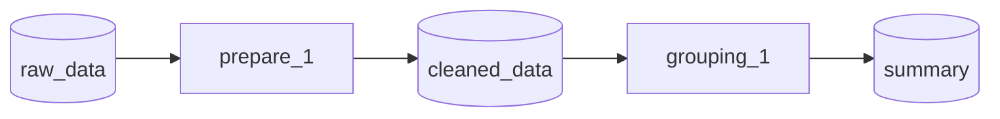

# Visualizers

Visualization engines for rendering Dataiku flows in multiple formats.

---

## visualize_flow()

Convenience function to generate a visual representation of a flow.

```python
from py2dataiku.visualizers import visualize_flow

svg = visualize_flow(flow, format="svg")
html = visualize_flow(flow, format="html")
ascii_art = visualize_flow(flow, format="ascii")
plantuml = visualize_flow(flow, format="plantuml")
mermaid = visualize_flow(flow, format="mermaid")
interactive = visualize_flow(flow, format="interactive")
```

**Parameters:**

| Parameter | Type | Default | Description |
|-----------|------|---------|-------------|
| `flow` | `DataikuFlow` | *required* | Flow to visualize |
| `format` | `str` | `"svg"` | Output format |
| `**kwargs` | | | Additional visualizer arguments |

**Returns:** `str` - Visualization content

**Supported formats:** `"svg"`, `"ascii"`, `"plantuml"`, `"html"`, `"interactive"`, `"mermaid"`

---

## SVGVisualizer

Generates pixel-accurate SVG that matches Dataiku DSS interface styling.

```python
from py2dataiku.visualizers import SVGVisualizer

viz = SVGVisualizer()
svg = viz.render(flow)
```

### Methods

| Method | Returns | Description |
|--------|---------|-------------|
| `render(flow)` | `str` | SVG markup |
| `export_png(flow, path, scale=2.0)` | `None` | Export as PNG (requires cairosvg) |
| `export_pdf(flow, path)` | `None` | Export as PDF (requires cairosvg) |

---

## HTMLVisualizer

Generates interactive HTML canvas with hover and click support.

```python
from py2dataiku.visualizers import HTMLVisualizer

viz = HTMLVisualizer()
html = viz.render(flow)
```

### Methods

| Method | Returns | Description |
|--------|---------|-------------|
| `render(flow)` | `str` | Complete HTML document |

---

## ASCIIVisualizer

Generates terminal-friendly text art representation.

```python
from py2dataiku.visualizers import ASCIIVisualizer

viz = ASCIIVisualizer()
text = viz.render(flow)
print(text)
```

### Methods

| Method | Returns | Description |
|--------|---------|-------------|
| `render(flow)` | `str` | ASCII diagram |

---

## MermaidVisualizer

Generates Mermaid diagram syntax compatible with GitHub, Notion, and documentation tools.

```python
from py2dataiku.visualizers.mermaid_visualizer import MermaidVisualizer

viz = MermaidVisualizer()
diagram = viz.render(flow)
```

### Methods

| Method | Returns | Description |
|--------|---------|-------------|
| `render(flow)` | `str` | Mermaid diagram syntax |

**Output example:**



---

## PlantUMLVisualizer

Generates PlantUML diagram syntax for documentation.

```python
from py2dataiku.visualizers import PlantUMLVisualizer

viz = PlantUMLVisualizer()
puml = viz.render(flow)
```

### Methods

| Method | Returns | Description |
|--------|---------|-------------|
| `render(flow)` | `str` | PlantUML diagram syntax |

---

## InteractiveVisualizer

Enhanced HTML with pan/zoom, search, and export capabilities.

```python
from py2dataiku.visualizers.interactive_visualizer import InteractiveVisualizer

viz = InteractiveVisualizer()
html = viz.render(flow)
```

---

## Themes

Pre-defined visual themes for SVG and HTML visualizers.

```python
from py2dataiku import DATAIKU_LIGHT, DATAIKU_DARK, DataikuTheme

# Use built-in themes
svg = flow.visualize(format="svg", theme=DATAIKU_LIGHT)
svg = flow.visualize(format="svg", theme=DATAIKU_DARK)
```

### DataikuTheme

Theme configuration dataclass. Contains colors, fonts, spacing, and styling parameters for recipes, datasets, and flow connections.

### Built-in Themes

| Theme | Description |
|-------|-------------|
| `DATAIKU_LIGHT` | Light theme matching Dataiku DSS default |
| `DATAIKU_DARK` | Dark theme for dark mode |

---

## Using via DataikuFlow

The most common way to generate visualizations is through `DataikuFlow` methods:

```python
flow = convert(code)

# String output
flow.visualize(format="svg")
flow.visualize(format="html")
flow.visualize(format="ascii")
flow.visualize(format="plantuml")
flow.visualize(format="mermaid")

# File output
flow.to_svg("output.svg")
flow.to_html("output.html")
flow.to_plantuml("output.puml")
flow.to_png("output.png")   # Requires cairosvg
flow.to_pdf("output.pdf")   # Requires cairosvg

# Jupyter notebooks
flow  # Automatically renders SVG via _repr_svg_()
```
