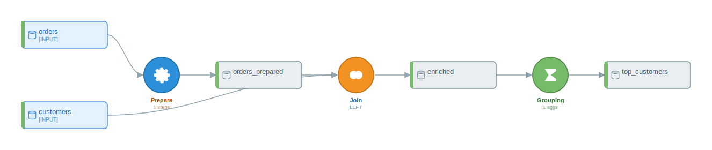
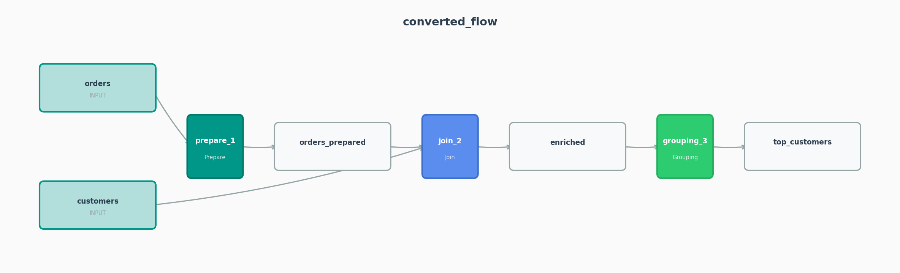
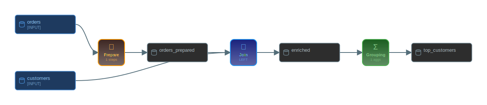

# Chapter 13 — Visual Aids and Flow Inspection

## What you'll learn

This is the canonical reference for every way py-iku lets you interrogate and render a `DataikuFlow`. The chapter covers programmatic inspection (summaries, derived dataset views, DAG navigation, structural diff), round-trip serialization to JSON and YAML, every visualization format the library ships (ASCII, Mermaid, PlantUML, SVG, PNG, PDF, HTML, interactive HTML), the two built-in themes, the three Jupyter rendering hooks, and a "which format when" decision matrix to pick the right output without guesswork.

## The fixture flow

Every section below operates on the same three-recipe flow so the outputs can be compared side by side. The source script reads two CSVs, fills missing discounts on `orders`, joins to `customers`, and aggregates per customer.

```python
from py2dataiku import convert

SOURCE = """
import pandas as pd

orders = pd.read_csv('orders.csv')
orders_clean = orders.fillna(0.0)

customers = pd.read_csv('customers.csv')
enriched = orders_clean.merge(customers, on='customer_id', how='left')

top_customers = enriched.groupby('customer_id').agg({'quantity': 'sum'}).reset_index()
"""

flow = convert(SOURCE)
```

The result has three [recipes](appendix-a-glossary.md#recipe) (PREPARE, JOIN, GROUPING) and five [datasets](appendix-a-glossary.md#dataset) (two inputs, three intermediates). That shape is small enough to inspect in full and big enough to exercise every method on `DataikuFlow` and `FlowGraph`.

## Programmatic inspection

The first job, before any rendering, is to ask the flow what it contains. Every method below is on the public surface and runs in milliseconds on a flow of any realistic size.

### `flow.get_summary()` — one-line headline

`get_summary()` returns a multi-line string covering counts, recipe-type breakdown, and any [optimizer](appendix-a-glossary.md#optimizer) notes. It is the right thing to print at the end of a CI conversion step or to drop into a Slack message.

```python
print(flow.get_summary())
# Flow: converted_flow
# Source: unknown
# Generated: 2026-04-26T22:10:40.535254
#
# Datasets: 5
#   - Input: 2
#   - Intermediate: 3
#   - Output: 0
#
# Recipes: 3
#   - grouping: 1
#   - join: 1
#   - prepare: 1
#
# Optimization Notes:
#   - prepare: 1 recipe(s)
#   - join: 1 recipe(s)
#   - grouping: 1 recipe(s)
```

### `flow.recipes` and `flow.datasets` — direct lists

The two collections that back every other view. Both are plain Python lists, so indexing, comprehensions, and `len()` work as expected.

```python
print([r.name for r in flow.recipes])
# ['prepare_1', 'join_2', 'grouping_3']

print([d.name for d in flow.datasets])
# ['orders', 'orders_prepared', 'customers', 'enriched', 'top_customers']
```

### `flow.input_datasets`, `intermediate_datasets`, `output_datasets` — derived views

These are properties that filter `flow.datasets` by `dataset_type`. They are not separate lists — mutating `flow.datasets` reflects in all three. The rule-based path classifies any dataset that is neither read by an external sink nor referenced as a source as intermediate; the LLM path covered in Chapter 7 handles output naming differently.

```python
print([d.name for d in flow.input_datasets])
# ['orders', 'customers']
print([d.name for d in flow.intermediate_datasets])
# ['orders_prepared', 'enriched', 'top_customers']
print([d.name for d in flow.output_datasets])
# []
```

### `flow.graph.topological_sort()` — node order

`flow.graph` returns a [FlowGraph](appendix-a-glossary.md#topological-order) — a DAG view over the same underlying data. `topological_sort()` runs Kahn's algorithm and returns a flat list of node names in dependency order; recipe nodes are prefixed `recipe:` to disambiguate them from datasets that share a name.

```python
for n in flow.graph.topological_sort():
    print(" ", n)
#   orders
#   customers
#   recipe:prepare_1
#   orders_prepared
#   recipe:join_2
#   enriched
#   recipe:grouping_3
#   top_customers
```

The [topological order](appendix-a-glossary.md#topological-order) is what every downstream tool that needs to iterate the flow uses, including the deployer covered in Chapter 11.

### `flow.graph.detect_cycles()` — cycle check

Cycle detection runs depth-first from every node and returns a list of cycles, each as a list of node names. A flow produced by `convert(...)` is a DAG by construction, so the result is always empty; the method is useful when constructing flows by hand or round-tripping through formats that allow malformed input. A non-empty return value means the flow cannot be deployed — DSS rejects cyclic flows at validation time — and should be treated as a hard error.

```python
print(flow.graph.detect_cycles())
# []
```

### `flow.graph.find_disconnected_subgraphs()` — orphan detection

Finds connected components in the undirected sense. A typical converted flow has one component; multiple components show up only when the input script defines two unrelated pipelines in the same file. Each component is returned as a `set` of node names.

```python
comps = flow.graph.find_disconnected_subgraphs()
print(len(comps), "component(s)")
# 1 component(s)
```

### DAG navigation: `get_predecessors`, `get_successors`, `get_roots`, `get_leaves`, `get_path`

Five methods cover every navigation question that comes up in practice: what feeds this node, what does this node feed, where does the flow start, where does it end, and is there a path between two named nodes.

```python
print(flow.graph.get_predecessors("recipe:join_2"))
# ['orders_prepared', 'customers']

print(flow.graph.get_successors("recipe:join_2"))
# ['enriched']

print(flow.graph.get_roots())
# ['orders', 'customers']

print(flow.graph.get_leaves())
# ['top_customers']

print(flow.graph.get_path("orders", "top_customers"))
# ['orders', 'recipe:prepare_1', 'orders_prepared',
#  'recipe:join_2', 'enriched', 'recipe:grouping_3', 'top_customers']
```

`get_path` runs BFS and returns the shortest path or `None`. For [lineage](appendix-a-glossary.md#lineage) tracing on a single column rather than node-level paths, `flow.get_column_lineage(column)` is the right entry point — it walks recipes backward and reports each transformation that touched the named column.

### Typed node access: `recipe_nodes` and `dataset_nodes`

When iteration is the goal and the node-type filter is the question, the two typed properties on `FlowGraph` are O(V) reads with no allocation overhead beyond the returned list.

```python
print([n.name for n in flow.graph.recipe_nodes])
# ['recipe:prepare_1', 'recipe:join_2', 'recipe:grouping_3']

print([n.name for n in flow.graph.dataset_nodes])
# ['orders', 'orders_prepared', 'customers', 'enriched', 'top_customers']
```

### `flow.optimization_notes` — what the optimizer did

After the optimizer pass runs (see Chapter 10), it deposits a list of human-readable strings on `flow.optimization_notes`. The strings are stable enough to assert against in CI when the test wants to confirm a specific merge happened; they are not stable enough to parse. Read them, do not regex-extract from them.

```python
for n in flow.optimization_notes:
    print(" -", n)
#  - prepare: 1 recipe(s)
#  - join: 1 recipe(s)
#  - grouping: 1 recipe(s)
```

The fixture has only one PREPARE in the input, so no merging happens. A flow with two adjacent PREPAREs that the optimizer collapses produces a `Merged 'prepare_1' + 'prepare_2' -> 'prepare_merged_prepare_1'` line — that string is the optimizer's audit trail for the merge.

### `flow.diff(other)` — structural comparison

Comparing two flows by hand is error-prone; `flow.diff(other_flow)` returns a structured dict with five keys: `added`, `removed`, `changed`, `dataset_added`, `dataset_removed`, plus an `equivalent` boolean. The diff is recipe-name-keyed and reports differences in `recipe_type`, `inputs`, and `outputs`. Settings-level differences (e.g. left vs inner join) are not compared — the diff is structural, not semantic.

```python
SOURCE_B = """
import pandas as pd

orders = pd.read_csv('orders.csv')
orders_clean = orders.fillna(0.0)

customers = pd.read_csv('customers.csv')
enriched = orders_clean.merge(customers, on='customer_id', how='left')
enriched = enriched.sort_values('customer_id')

top_customers = enriched.groupby('customer_id').agg({'quantity': 'sum'}).reset_index()
"""

flow_b = convert(SOURCE_B)
import json
print(json.dumps(flow.diff(flow_b), indent=2))
# {
#   "added": [
#     {"name": "grouping_4", "type": "grouping"},
#     {"name": "sort_3", "type": "sort"}
#   ],
#   "removed": [
#     {"name": "grouping_3", "type": "grouping"}
#   ],
#   "changed": [],
#   "dataset_added": ["enriched_sorted"],
#   "dataset_removed": [],
#   "equivalent": false
# }
```

The added `sort_values` shows up as one new SORT recipe plus a renumbered GROUPING — the rule-based generator's recipe-name counter advances when a new recipe is inserted, so adjacent recipes get fresh names. Asserting against `equivalent` in CI is the cheapest way to detect any structural drift between two conversions of the same script.

## Round-trip serialization

The flow object is checked-in artifact-shaped: it serialises to JSON and YAML, both round-trip through `from_json` / `from_yaml`, and `save`/`load` auto-detect the format from the file extension. Nothing in the inspection layer above mutates the flow, so round-tripping commutes with any of those reads.

### `to_dict(include_timestamp=False)` for byte-stable comparisons

`to_dict()` is the underlying representation; `to_json` and `to_yaml` are thin wrappers. The `include_timestamp` argument is the flag that makes the dict suitable for byte-level comparison — without it, the same conversion run twice produces dicts that differ by one wallclock field.

```python
d1 = flow.to_dict(include_timestamp=False)
d2 = convert(SOURCE).to_dict(include_timestamp=False)
print(d1 == d2)
# True
```

That property is what makes the fixture-pinning pattern in Chapter 11 viable: a recorded `to_dict(include_timestamp=False)` is a faithful checkpoint that can be diffed in PR review.

### `to_json()` / `from_json()`

JSON is the exchange format of choice for CI artifacts and for any downstream tool that reads a flow as data.

```python
from py2dataiku import DataikuFlow

js = flow.to_json()
flow_j = DataikuFlow.from_json(js)
assert [r.name for r in flow_j.recipes] == [r.name for r in flow.recipes]
```

### `to_yaml()` / `from_yaml()`

YAML is the right choice when the flow lives next to human-edited config (a `pyproject.toml` block, a Helm chart). The YAML serialiser preserves key order and uses block style, so diffs read cleanly.

```python
ya = flow.to_yaml()
print(ya.split("\n")[0])
# flow_name: converted_flow

flow_y = DataikuFlow.from_yaml(ya)
assert len(flow_y.recipes) == len(flow.recipes)
```

### `flow.save(path)` and `DataikuFlow.load(path)` — extension auto-detection

`save` accepts `.json`, `.yaml`, `.yml`, `.svg`, `.html`, `.png`, `.pdf`, `.puml`/`.plantuml`, `.txt`, and `.md`/`.mermaid` — the format is inferred from the extension unless the caller passes `format=` explicitly. `load` is symmetric only for the data formats (`.json`, `.yaml`, `.yml`); the visual formats are not round-trippable.

```python
import tempfile, os

with tempfile.TemporaryDirectory() as tmp:
    flow.save(os.path.join(tmp, "flow.json"))
    flow.save(os.path.join(tmp, "flow.yaml"))
    rebuilt = DataikuFlow.load(os.path.join(tmp, "flow.json"))
    print(len(rebuilt.recipes))
# 3
```

## Visualization formats

Every format in this section is produced from the same fixture flow. The library currently ships seven visualizers: ASCII, Mermaid, PlantUML, SVG, HTML, interactive HTML, and matplotlib (PNG). PDF is generated by routing SVG through `cairosvg`. The dispatcher is `flow.visualize(format=...)`; the convenience methods `to_svg`, `to_ascii`, `to_html`, `to_plantuml`, `to_png`, and `to_pdf` cover the most common saves.

### ASCII — pure text DAG

The ASCII renderer is the right choice for a terminal session, a CI log, or anywhere a fixed-width text artifact is the only viable option. It draws boxes with Unicode line-drawing characters and a small legend.

```python
print(flow.to_ascii())
# (excerpted)
# ════════════════════════════════════════════════════════════════════════════════
#                           DATAIKU FLOW: converted_flow
# ════════════════════════════════════════════════════════════════════════════════
#
#                               ┌──────────────────┐
#                               │ orders            │
#                               │    [INPUT]        │
#                               └──────────────────┘
#                                        │
#                                        ▼
#                                 ┌──────────────┐
#                                 │   PREPARE    │
#                                 │ 1 steps      │
#                                 └──────────────┘
# ...
```

### Mermaid — Markdown-embeddable diagram source

Mermaid syntax embeds directly in GitHub PR descriptions, GitLab issues, and any Markdown renderer that supports the `mermaid` fenced-block extension. The text is the artifact — there is no binary to ship.

```python
print(flow.visualize(format="mermaid"))
```

```mermaid
flowchart TD
    subgraph inputs[Input Datasets]
        D0[(orders)]
        D2[(customers)]
    end
    D1[(orders_prepared)]
    D3[(enriched)]
    D4[(top_customers)]
    R0{Prepare\n(1 steps)}
    R1{Join\n(LEFT)}
    R2{Grouping\n(1 aggs)}
    D0 --> R0
    R0 --> D1
    D1 --> R1
    D2 --> R1
    R1 --> D3
    D3 --> R2
    R2 --> D4
```

### PlantUML — long-form documentation diagram

PlantUML is the right choice for design docs in Confluence or any wiki that has a PlantUML plugin, and for printed engineering documents where the rendered diagram needs to be regenerable from source.

```python
print(flow.to_plantuml())
# @startuml
# !theme plain
# ... (skinparam blocks) ...
# rectangle "orders" <<input>> as orders
# rectangle "customers" <<input>> as customers
# rectangle "orders_prepared" <<intermediate>> as orders_prepared
# ...
# orders --> recipe_0
# recipe_0 --> orders_prepared
# orders_prepared --> recipe_1
# customers --> recipe_1
# recipe_1 --> enriched
# enriched --> recipe_2
# recipe_2 --> top_customers
# @enduml
```

### SVG — vector

SVG is the primary format. It is what `_repr_svg_` returns to Classic Jupyter, what the matplotlib renderer falls back from, and what `to_pdf` and the PNG path eventually consume. Because it is vector, it scales to any slide-deck or print resolution without re-rendering.

```python
flow.to_svg("docs/textbook/assets/visual-aids/fixture-flow.svg")
```



### PNG — raster (matplotlib renderer)

`flow.visualize(format="png")` routes through `MatplotlibVisualizer` and returns raw PNG bytes. `flow.save("file.png")` writes the same bytes. The matplotlib path is preferred for PNG over the cairosvg-of-SVG path because it gives finer control over DPI and font rendering on the matplotlib side.

```python
png_bytes = flow.visualize(format="png")
with open("docs/textbook/assets/visual-aids/fixture-flow.png", "wb") as f:
    f.write(png_bytes)
```



### PDF — print

`to_pdf` routes the SVG output through `cairosvg`, which must be installed (`pip install cairosvg`). The result is a one-page vector PDF, suitable for printing or for embedding in a LaTeX document.

```python
flow.to_pdf("docs/textbook/assets/visual-aids/fixture-flow.pdf")
```

The PDF is at [`assets/visual-aids/fixture-flow.pdf`](assets/visual-aids/fixture-flow.pdf).

### HTML — embeddable

`to_html` produces a self-contained HTML document with the SVG inlined and minimal CSS. Drop it into a static-site generator, attach it to an email, or open it directly in a browser.

```python
flow.to_html("docs/textbook/assets/visual-aids/fixture-flow.html")
```

The HTML page is at [`assets/visual-aids/fixture-flow.html`](assets/visual-aids/fixture-flow.html).

### Interactive HTML — pan, zoom, hover

`flow.visualize(format="interactive")` returns a richer HTML document with embedded JavaScript for pan, zoom, search, and hover-highlighting. It is dispatched through `InteractiveVisualizer` and ships as a single self-contained file.

```python
interactive = flow.visualize(format="interactive")
with open("docs/textbook/assets/visual-aids/fixture-flow-interactive.html", "w") as f:
    f.write(interactive)
```

The interactive page is at [`assets/visual-aids/fixture-flow-interactive.html`](assets/visual-aids/fixture-flow-interactive.html).

### Markdown / TXT — fallback

`flow.save("file.md")` writes the Mermaid source; `flow.save("file.txt")` writes the ASCII text. Both are convenience extensions for the dispatcher and produce no new content beyond what the corresponding `visualize(format=...)` call returns.

## Themes

`py2dataiku.visualizers.themes` exports two themes: `DATAIKU_LIGHT` (the default) and `DATAIKU_DARK`. The theme controls background, recipe-fill gradients, edge colour, and label colour; the layout is identical between them. Pass the theme to a visualizer directly.

```python
from py2dataiku.visualizers import DATAIKU_DARK, DATAIKU_LIGHT, SVGVisualizer

light = SVGVisualizer(theme=DATAIKU_LIGHT).render(flow)
dark = SVGVisualizer(theme=DATAIKU_DARK).render(flow)

with open("docs/textbook/assets/visual-aids/fixture-flow-light.svg", "w") as f:
    f.write(light)
with open("docs/textbook/assets/visual-aids/fixture-flow-dark.svg", "w") as f:
    f.write(dark)
```

| Light | Dark |
|---|---|
|  |  |

The default `to_svg()` path uses `DATAIKU_LIGHT`; pass a theme through `SVGVisualizer(theme=...)` to override. The matplotlib (PNG) path takes a `theme=` kwarg on `flow.visualize(format="png", theme=...)`.

## Jupyter integration

Three repr hooks on `DataikuFlow` cover the three notebook frontends in common use. None of them require an explicit `flow.visualize(...)` call — typing `flow` at the end of a cell is enough.

### `_repr_svg_` — Classic Jupyter

Classic Jupyter notebooks call `_repr_svg_` directly when the cell's last expression is a `DataikuFlow`. The method delegates to `flow.visualize(format="svg")`, so the inline rendering matches what `to_svg()` would write to disk.

### `_repr_html_` — HTML-friendly notebooks and reporting tools

Some notebook frontends and reporting tools display HTML reprs differently — wrapped in their own container, scrollable, with additional metadata. `_repr_html_` returns the SVG inline wrapped in a minimal `<div class="py-iku-flow">` fragment, which keeps the styling under the host frontend's control.

### `_repr_mimebundle_` — JupyterLab and VS Code

JupyterLab 3+ and VS Code's notebook frontend prefer `_repr_mimebundle_` over the format-specific reprs. Without this method, those frontends fall back to the plain Python repr string and the user assumes the library does not render flows. The method returns a dict with two keys, `image/svg+xml` and `text/plain`, so the frontend can pick whichever it prefers.

```python
mb = flow._repr_mimebundle_()
print(list(mb.keys()))
# ['image/svg+xml', 'text/plain']
```

The three methods are independent — every notebook frontend in regular use ends up calling exactly one of them, and the library implements all three so no frontend silently falls through to a plain repr.

## Which format when

| Goal | Best format | Why |
|---|---|---|
| Quick terminal check | `to_ascii()` | No binary, no dependencies, copy-pasteable into a chat |
| Embed in a PR description | `visualize(format="mermaid")` | GitHub renders Mermaid in fenced blocks; no asset to host |
| Slide deck | `to_svg()` or PNG via `visualize(format="png")` | SVG scales without pixelation; PNG embeds anywhere |
| Wiki / Confluence | PNG or `to_plantuml()` | Confluence renders PlantUML natively if the plugin is installed; PNG is the universal fallback |
| Print or LaTeX | `to_pdf()` | Vector, single page, paper-size-aware |
| AI / code-review tool | Mermaid or PlantUML (text) | Text-only diagrams are diffable in version control |
| Notebook inline | rely on `_repr_svg_` / `_repr_mimebundle_` (no explicit call) | Frontends pick the right repr automatically |
| Diff two flows | `flow.diff(other)` | Structured dict, recipe-name-keyed, machine-readable |
| CI artifact | `to_json()` plus `to_svg()` | JSON for asserts, SVG for the human reviewer attached to the build |
| Customer-facing page | `to_html()` or interactive HTML | Self-contained, no static-asset pipeline required |

The matrix is opinionated. Two heuristics override it. First, anywhere the artifact has to survive a year — pick a vector format (SVG or PDF) so a future regenerate reproduces it cleanly. Second, anywhere the audience is going to ask "what changed?" — pick the structured diff (`flow.diff`) and render the difference, not the post-change shape alone.

## Further reading

- [Glossary](appendix-a-glossary.md) — definitions for dataset, recipe, processor, optimizer, topological order, lineage.
- [Cheatsheet](appendix-c-cheatsheet.md) — visualization quick reference with one-line invocations.
- [Chapter 3, Anatomy of a Flow](03-anatomy-of-a-flow.md) — `FlowGraph` deep dive and the round-trip serialization contract.
- [Chapter 10, Optimization and the DAG](10-optimization-and-dag.md) — what the optimizer does and how to read `optimization_notes`.
- [Models API reference](../api/models.md) — `DataikuFlow`, `DataikuRecipe`, `DataikuDataset`.
- [Graph API reference](../api/graph.md) — `FlowGraph` and DAG operations.
- [Visualizers API reference](../api/visualizers.md) — every visualizer class and its render method.
- [Notebook 04: expert patterns](https://github.com/m-deane/py-iku/blob/main/notebooks/04_expert.ipynb) — exercises every visualization format on the V5 running example.

## What's next

This is the final numbered chapter. Move on to the appendices: A for terms, B for known issues and fixes, C for the printable cheatsheet.
