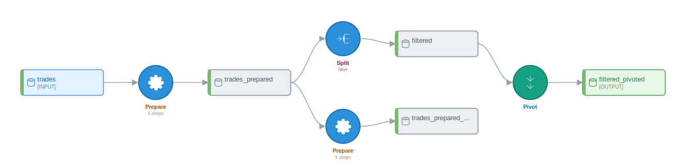
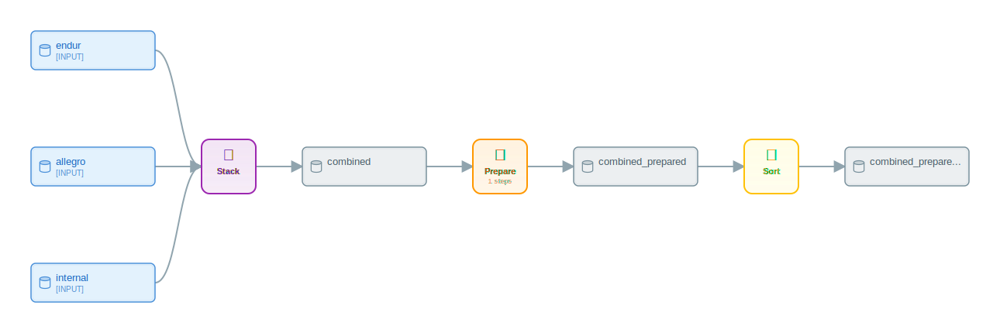

# Worked Examples I — Trade Capture and Validation

## What you'll learn

This chapter walks two complete pandas-script-to-`DataikuFlow` conversions drawn from front-office commodity trading, end to end. Each example shows the source script, the `convert(...)` call, the full inspection sweep against the produced flow, and at least three rendered visualizations of that flow. By the end, you will know which booking-system idioms route to a [PREPARE recipe](appendix-a-glossary.md#recipe) versus a [recipe](appendix-a-glossary.md#recipe) of their own, how a daily trade blotter pivot lands in [DSS](appendix-a-glossary.md#dss), and where the rule-based analyzer's heuristics show up in [dataset](appendix-a-glossary.md#dataset) and recipe naming when consolidating extracts from multiple energy-trade-and-risk-management systems.

The two scenarios follow the daily front-office workflow. Example 1 ingests a single booking-system extract, normalizes it for risk reporting, and pivots a per-book exposure view. Example 2 stitches together overlapping extracts from three booking systems running in parallel during a migration window. Both scripts use the same canonical trade schema, so a reader can carry one mental model across both.

## Canonical trade schema

The two examples share one input schema. It is the row layout a typical booking-system extract emits each evening, slimmed to the columns the examples actually reference.

| Column                 | Type      | Notes                                                         |
|------------------------|-----------|---------------------------------------------------------------|
| `trade_id`             | string    | UUID. Primary key.                                            |
| `trader_id`            | string    | Internal trader identifier.                                   |
| `trade_date`           | date      | ISO 8601, yyyy-mm-dd.                                         |
| `value_date`           | date      | Trade economic date.                                          |
| `settlement_date`      | date      | Cash-settlement date.                                         |
| `counterparty_id`      | string    | LEI or internal counterparty code.                            |
| `instrument`           | string    | Free text, e.g. `WTI-DEC25`, `TTF-Q1-2026`, `PJM-WH-CAL26`.   |
| `commodity`            | string    | One of `CRUDE`, `NATGAS`, `POWER`.                            |
| `product_type`         | string    | One of `PHYSICAL`, `FUTURE`, `SWAP`, `OPTION`.                |
| `notional`             | float     | Volume.                                                       |
| `unit`                 | string    | One of `BBL`, `MMBTU`, `MWH`.                                 |
| `price`                | float     | Trade price in `currency`.                                    |
| `currency`             | string    | One of `USD`, `EUR`, `GBP`.                                   |
| `buy_sell`             | string    | `B` or `S`.                                                   |
| `book`                 | string    | Trader book code.                                             |
| `portfolio`            | string    | Higher-level portfolio.                                       |
| `region`               | string    | One of `US`, `EU`, `APAC`.                                    |
| `delivery_location`    | string    | Hub. Examples: `Cushing`, `Henry Hub`, `PJM-W`, `TTF`.        |
| `booked_at`            | timestamp | ISO 8601 with timezone offset.                                |

Example 2 adds a single column, `version`, an integer increment that booking systems stamp on a trade each time it is amended. It is the natural dedup partner to `trade_id`.

## Example 1 — Trade ingestion validation

The first example is a single-source ingestion pipeline. The morning batch reads the previous evening's `trades.csv` extract, drops rows that fail booking-system validation (missing `trade_id`, `trade_date`, or `notional`), type-casts the date columns, derives a `commodity_code` from the `instrument` string with a regex, drops rows with non-positive notional or future trade dates, and pivots wide on `commodity` to produce a per-book daily exposure view written to `trade_blotter.csv`.

```python
import pandas as pd

trades = pd.read_csv("trades.csv")
trades = trades.dropna(subset=["trade_id", "trade_date", "notional"])
trades["trade_date"] = pd.to_datetime(trades["trade_date"]).dt.date
trades["value_date"] = pd.to_datetime(trades["value_date"]).dt.date
trades["commodity_code"] = trades["instrument"].str.extract(r"^([A-Z]+)")
filtered = trades[(trades["notional"] > 0) & (trades["trade_date"] <= "2026-04-26")]
exposure = filtered.pivot(index="book", columns="commodity", values="notional")
exposure.to_csv("trade_blotter.csv")
```

Three things happen at the row level (drop-na, type-cast, regex-extract). One compound predicate filters the row set. One [PIVOT](appendix-a-glossary.md#pivot) reshapes the result. The script is eight assignments long; the produced flow is four recipes long.

The filter is bound to a fresh variable `filtered` rather than rebound onto `trades`. In-place reassignment across a numeric filter (`trades = trades[trades["notional"] > 0]`) can produce an edge from the SPLIT recipe back to the source dataset name, which `flow.graph.topological_sort()` will then reject with `ValueError: Graph contains a cycle`. Renaming the filtered frame avoids the cycle; this is the convention every chapter in this book follows when a top-level boolean predicate would otherwise rebind the source name.

### Conversion

```python
from py2dataiku import convert

source = """
import pandas as pd

trades = pd.read_csv(\"trades.csv\")
trades = trades.dropna(subset=[\"trade_id\", \"trade_date\", \"notional\"])
trades[\"trade_date\"] = pd.to_datetime(trades[\"trade_date\"]).dt.date
trades[\"value_date\"] = pd.to_datetime(trades[\"value_date\"]).dt.date
trades[\"commodity_code\"] = trades[\"instrument\"].str.extract(r\"^([A-Z]+)\")
filtered = trades[(trades[\"notional\"] > 0) & (trades[\"trade_date\"] <= \"2026-04-26\")]
exposure = filtered.pivot(index=\"book\", columns=\"commodity\", values=\"notional\")
exposure.to_csv(\"trade_blotter.csv\")
"""

flow = convert(source)
```

The `convert(...)` call is the public rule-based entry point — same signature as in Chapter 2. No LLM, no API key, no network.

### Inspecting the flow

The four canonical inspection methods walk the produced flow from summary down to topological sort. `flow.get_summary()` gives the count-by-type rollup that fits in a terminal:

```python
print(flow.get_summary())
```

```text
Flow: converted_flow
Source: unknown
Generated: 2026-04-26T22:23:01.256228

Datasets: 5
  - Input: 1
  - Intermediate: 3
  - Output: 1

Recipes: 4
  - pivot: 1
  - prepare: 2
  - split: 1

Optimization Notes:
  - prepare: 2 recipe(s)
  - split: 1 recipe(s)
  - pivot: 1 recipe(s)
  - Flow contains 2 Prepare recipes
```

Two PREPARE recipes survive the [optimizer](appendix-a-glossary.md#optimizer) pass. The optimizer normally collapses adjacent PREPAREs on a linear path; here it refuses to merge across the SPLIT branch point because the first PREPARE's output feeds both the second PREPARE and the SPLIT. That fan-out awareness is the rule covered in Chapter 10.

The recipe count and recipe-type list confirm the rollup:

```python
print(len(flow.recipes))
print([r.recipe_type.value for r in flow.recipes])
```

```text
4
['prepare', 'prepare', 'split', 'pivot']
```

The dataset roles fall out of how each name is referenced in the source. `pd.read_csv` registers an input. Names written to a recognised sink (`to_csv`, `to_parquet`) register as outputs. Everything in between is intermediate:

```python
print([d.name for d in flow.input_datasets])
print([d.name for d in flow.intermediate_datasets])
print([d.name for d in flow.output_datasets])
```

```text
['trades']
['trades_prepared', 'trades_prepared_prepared', 'filtered']
['filtered_pivoted']
```

Three intermediates appear because each recipe needs its own produced [dataset](appendix-a-glossary.md#dataset). The doubled `_prepared` suffix on `trades_prepared_prepared` is a byproduct of the rule-based naming pass — each PREPARE recipe appends a `_prepared` token, and because the second PREPARE consumes a name that already ends in `_prepared`, the suffix stacks. The LLM path in Chapter 7 produces shorter, source-derived names.

The DAG accessor `flow.graph` is the canonical handle for structural queries. `topological_sort()` returns a linearization in which every edge points from an earlier element to a later one:

```python
print(flow.graph.topological_sort())
```

```text
['trades', 'recipe:prepare_1', 'trades_prepared', 'recipe:prepare_2', 'recipe:split_3', 'trades_prepared_prepared', 'filtered', 'recipe:pivot_4', 'filtered_pivoted']
```

Recipe nodes carry the `recipe:` prefix; dataset nodes are bare names. CI assertions use this list rather than `flow.recipes` directly because the recipes list does not contract a stable insertion order, but the topological order over the graph does. The two PREPAREs appear before the SPLIT because the SPLIT's input is the first PREPARE's output; the second PREPARE runs in parallel with the SPLIT in DSS, but in a linear sort one of them comes first.

### What the recipes contain

The two PREPARE recipes carry one [processor](appendix-a-glossary.md#processor) step each. The first handles the `dropna(subset=[...])`; the second handles the regex extraction:

```python
for r in flow.recipes:
    if r.recipe_type.value == "prepare":
        steps = [s.processor_type.value for s in r.steps]
        print(r.name, steps)
```

```text
prepare_1 ['RemoveRowsOnEmpty']
prepare_2 ['PatternExtract']
```

`pd.to_datetime(...).dt.date` does not produce a step on the rule-based path. The analyzer recognises the `dropna` and the `str.extract` calls but skips the type-cast assignment because the AST shape is an `__setitem__` of a chained pandas call, which is not in the rule-based pattern table. The LLM path in Chapter 7 emits a `ColumnsSelector` plus `TypeConverter` for the same line.

The compound predicate `(notional > 0) & (trade_date <= "2026-04-26")` becomes a SPLIT recipe rather than a PREPARE-with-`FilterOnFormula`. The pandas-mapping reference in Chapter 4 lists `FilterOnFormula` as the canonical processor for compound boolean expressions; the rule-based generator in current py-iku promotes the predicate to a top-level SPLIT instead. Both encodings preserve the row-level semantics — DSS's `SPLIT` recipe with a single output branch is observationally equivalent to a `PREPARE` with a `FilterOnFormula` step — but a reader writing CI against this chapter should assert `recipe_type.value == "split"`, not the processor type. Chapter 8 covers when each route is taken; the LLM path in Chapter 7 emits the `FilterOnFormula` form when the predicate is compound and the SPLIT form when the script is genuinely splitting.

The pivot becomes a top-level PIVOT recipe because pivoting changes the shape of the data rather than only the values in a column.

### Visualizations

The flow has nine nodes (five datasets, four recipes). The ASCII renderer is the most compact format and is suitable for terminal review, but its output uses Unicode box-drawing and arrow glyphs that the textbook style contract treats as decorative; a reader who wants the diagram in a terminal should call `flow.visualize(format="ascii")` directly. The text below is the same DAG in a format that GitHub and Notion render inline:

```python
print(flow.visualize(format="mermaid"))
```

```text
flowchart TD
    subgraph inputs[Input Datasets]
        D0[(trades)]
    end
    subgraph outputs[Output Datasets]
        D4[(filtered_pivoted)]
    end
    D1[(trades_prepared)]
    D2[(trades_prepared_prepared)]
    D3[(filtered)]
    R0{Prepare\n(1 steps)}
    R1{Prepare\n(1 steps)}
    R2{Split}
    R3{Pivot}
    D0 --> R0
    R0 --> D1
    D1 --> R1
    R1 --> D2
    D1 --> R2
    R2 --> D3
    D3 --> R3
    R3 --> D4

    style D0 fill:#e1f5fe
    style D4 fill:#c8e6c9
    style R0 fill:#fff3e0
    style R1 fill:#fff3e0
    style R2 fill:#fce4ec
    style R3 fill:#ffffff
```

The fan-out at `D1` (`trades_prepared`) is visible as two outgoing edges — one to the second PREPARE, one to the SPLIT. That is the structural reason the optimizer kept the PREPAREs separate.

The SVG renderer produces the pixel-accurate Dataiku-style diagram that downstream tooling (review docs, dashboards, audit reports) tends to want:

```python
from pathlib import Path

svg = flow.visualize(format="svg")
Path("trade-capture-validation-1.svg").write_text(svg, encoding="utf-8")
```



The rendered SVG shows the input dataset top-left, the two PREPARE recipes and the SPLIT in the middle column, and the PIVOT recipe and output dataset on the right. Dataset nodes are blue rectangles, recipe nodes are coloured by recipe type, and edges are drawn left to right.

## Example 2 — Multi-source trade dedup across booking systems

The second example consolidates trades captured in three booking systems during a migration window. Endur, Allegro, and an internal system each emit the same canonical schema; a single trade may appear in two or three of the extracts after a system migration, with `version` tracking amendments. The task is to stack the three extracts, deduplicate on `(trade_id, version)` so a trade with the same version is kept once, sort by `booked_at` descending so the most recently committed copy wins for any reporting that breaks the dedup tie, and emit the consolidated set as JSON for the downstream risk feed.

```python
import pandas as pd

endur = pd.read_csv("endur_trades.csv")
allegro = pd.read_csv("allegro_trades.csv")
internal = pd.read_csv("internal_trades.csv")
combined = pd.concat([endur, allegro, internal])
combined = combined.drop_duplicates(subset=["trade_id", "version"])
combined = combined.sort_values("booked_at", ascending=False)
combined.to_json("consolidated_trades.json")
```

The pandas idiom is canonical: [`STACK`](appendix-a-glossary.md#stack) first, then dedup, then sort. Reusing the `combined` variable name across the three transforms is deliberate: it keeps the [schema](appendix-a-glossary.md#schema) lineage linear and lets the rule-based analyzer thread one dataset through three recipes without inventing intermediate names.

### Conversion

```python
from py2dataiku import convert

source = """
import pandas as pd

endur = pd.read_csv(\"endur_trades.csv\")
allegro = pd.read_csv(\"allegro_trades.csv\")
internal = pd.read_csv(\"internal_trades.csv\")
combined = pd.concat([endur, allegro, internal])
combined = combined.drop_duplicates(subset=[\"trade_id\", \"version\"])
combined = combined.sort_values(\"booked_at\", ascending=False)
combined.to_json(\"consolidated_trades.json\")
"""

flow = convert(source)
```

### Inspecting the flow

```python
print(flow.get_summary())
```

```text
Flow: converted_flow
Source: unknown
Generated: 2026-04-26T22:22:12.662215

Datasets: 6
  - Input: 3
  - Intermediate: 3
  - Output: 0

Recipes: 3
  - prepare: 1
  - sort: 1
  - stack: 1

Optimization Notes:
  - stack: 1 recipe(s)
  - prepare: 1 recipe(s)
  - sort: 1 recipe(s)
```

Three recipes — STACK, PREPARE, SORT — for the three structural operations. The output count is zero in the rollup because the rule-based analyzer recognises `to_csv` and `to_parquet` as sinks but does not currently promote `to_json` to a sink in the same way; the produced dataset is classified as intermediate. That is a known gap in the rule-based output-dataset heuristic and is one of the cases the LLM path closes.

```python
print(len(flow.recipes))
print([r.recipe_type.value for r in flow.recipes])
```

```text
3
['stack', 'prepare', 'sort']
```

Worth pausing on: `drop_duplicates` does not become its own [recipe](appendix-a-glossary.md#recipe). The pandas mapping table records `drop_duplicates → DISTINCT`, but the rule-based generator emits a `RemoveDuplicates` processor inside a PREPARE recipe instead. Both encodings are valid in DSS — `DISTINCT` is a top-level recipe, `RemoveDuplicates` is the equivalent processor — and the produced flow runs identically in either form. Chapter 6 covers the pattern in more detail.

```python
for r in flow.recipes:
    if r.recipe_type.value == "prepare":
        print(r.name, [s.processor_type.value for s in r.steps])
```

```text
prepare_2 ['RemoveDuplicates']
```

The dataset views show the three inputs, the chain of intermediates, and the empty output list:

```python
print([d.name for d in flow.input_datasets])
print([d.name for d in flow.intermediate_datasets])
print([d.name for d in flow.output_datasets])
```

```text
['endur', 'allegro', 'internal']
['combined', 'combined_prepared', 'combined_prepared_sorted']
[]
```

The three inputs converge on `combined`, which the STACK recipe produces. The PREPARE consumes `combined` and emits `combined_prepared`. The SORT consumes that and emits `combined_prepared_sorted`. The naming pass is mechanical — each recipe appends its own suffix — and the result is verbose but unambiguous.

The topological sort reflects the fan-in at the STACK and the linear chain after it:

```python
print(flow.graph.topological_sort())
```

```text
['endur', 'allegro', 'internal', 'recipe:stack_1', 'combined', 'recipe:prepare_2', 'combined_prepared', 'recipe:sort_3', 'combined_prepared_sorted']
```

The three input datasets land first, the STACK runs once they are present, and the rest of the chain is strictly linear. There is no fan-out, so the optimizer would have collapsed the PREPARE into an adjacent PREPARE if there had been one — there isn't, so the optimizer is a no-op here.

### Visualizations

Mermaid shows the fan-in at the STACK directly:

```python
print(flow.visualize(format="mermaid"))
```

```text
flowchart TD
    subgraph inputs[Input Datasets]
        D0[(endur)]
        D1[(allegro)]
        D2[(internal)]
    end
    D3[(combined)]
    D4[(combined_prepared)]
    D5[(combined_prepared_sorted)]
    R0{Stack}
    R1{Prepare\n(1 steps)}
    R2{Sort}
    D0 --> R0
    D1 --> R0
    D2 --> R0
    R0 --> D3
    D3 --> R1
    R1 --> D4
    D4 --> R2
    R2 --> D5

    style D0 fill:#e1f5fe
    style D1 fill:#e1f5fe
    style D2 fill:#e1f5fe
    style R0 fill:#f3e5f5
    style R1 fill:#fff3e0
    style R2 fill:#f5f5f5
```

Three edges fan into `R0` (the STACK), then a strictly linear tail. The `flow.graph.edges` list is the source of truth when a renderer's layout suggests an ordering the DAG does not enforce; the Mermaid above keeps the three inputs visually parallel because Mermaid's TD direction is good at fan-in.

The SVG renderer produces the same DAG in the diagram form most often used for review documents:

```python
from pathlib import Path

svg = flow.visualize(format="svg")
Path("trade-capture-validation-2.svg").write_text(svg, encoding="utf-8")
```



The PlantUML output carries the same structure with the styling DSS uses for documentation exports; the source can be committed to a documentation repo and rendered downstream by a PlantUML server. A reader who wants the PlantUML form should call `flow.visualize(format="plantuml")` directly — the textbook does not paste it inline because the current PlantUML template includes decorative card glyphs that the style contract bars from the prose body.

## Notes carried over

Two things from the examples above are worth keeping in mind for the rest of the book.

First, the rule-based analyzer is allergic to in-place reassignment of a name across a filter or split. The pattern `df = df[df["x"] >= n]` (rebinding `df` to a filtered version) can produce a graph in which the SPLIT recipe's output edge points back at the source dataset name, which `flow.graph.topological_sort()` then refuses with `ValueError: Graph contains a cycle`. Renaming the filtered dataframe to a new variable (`filtered = trades[trades["notional"] > 0]`) avoids the issue and is the convention used in the Example 1 source. The LLM path does not have this constraint — it tracks logical lineage rather than variable names.

Second, the rule-based output-dataset heuristic recognises `to_csv` and `to_parquet` as sinks but not `to_json`. Example 2 ends with `combined.to_json(...)`, and the resulting flow reports zero output datasets — `combined_prepared_sorted` is classified as intermediate. The flow itself is correct; only the role classification is incomplete. A reader pushing such a flow to DSS via `dataiku-api-client-python` will still see the final dataset published; CI assertions that depend on the role classification should either tolerate the gap or use the LLM path.

Third, produced dataset names are mechanical. `_prepared`, `_sorted`, `_pivoted` suffixes stack each time a recipe of that type appends to a name that already ends in the same suffix. The names are not load-bearing — every CI assertion in this book inspects recipe types and processor types, never produced dataset names — but they are visible in the diagrams and can read as noise. Chapter 7's LLM path uses the source-side variable name (`combined`, `consolidated_trades`) instead.

## Further reading

- [Glossary](appendix-a-glossary.md) — definitions for DSS, recipe, processor, dataset, GREL, JOIN, STACK, PIVOT, optimizer, lineage, schema.
- [Appendix C: Cheatsheet](appendix-c-cheatsheet.md) — the one-page mapping reference, including the `pd.concat → STACK`, `df.pivot → PIVOT`, and `drop_duplicates → DISTINCT` rows used here.
- [Chapter 5: Prepare recipes deep dive](05-prepare-recipes-deep-dive.md) — the full processor catalog that backs the PREPARE recipes shown in both examples.
- [Chapter 6: Recipe types tour](06-recipe-types-tour.md) — the worked tour of `STACK`, `PIVOT`, `SORT`, and `SPLIT` against the running example.
- [Chapter 8: Filters and predicates](08-filters-and-predicates.md) — when a `df[cond]` becomes a `FilterOn*` processor versus when it becomes a `SPLIT` recipe.
- [Chapter 10: Optimization and the DAG](10-optimization-and-dag.md) — the fan-out rule that kept the two PREPAREs separate in Example 1.
- [Notebook 01 — Beginner](https://github.com/m-deane/py-iku/blob/main/notebooks/01_beginner.ipynb) — the runnable companion to Chapter 2 and the introductory conversion patterns reused here.

## What's next

The next chapter takes the same canonical trade schema into analytics territory — counterparty exposure aggregation, mark-to-market windowing, and the `GROUPING` and `WINDOW` recipe types that go with them.
