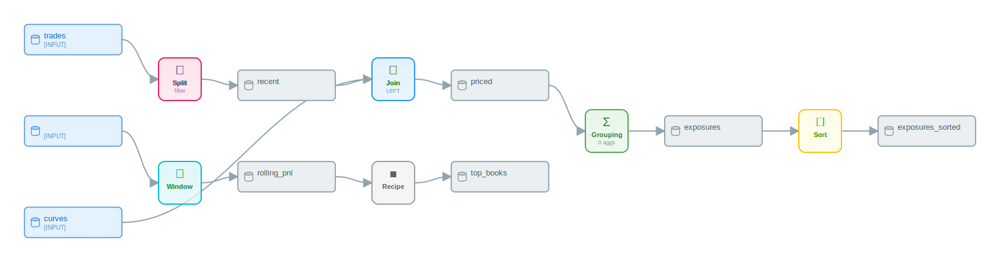

# Worked Examples II — Position and P&L Analytics

## What you'll learn

This chapter walks two end-to-end pandas-script-to-`DataikuFlow` conversions drawn from front-office commodity trading. The first builds a cross-commodity position-and-mark-to-market pipeline: a date filter, a curve [JOIN](appendix-a-glossary.md#join), a GROUPING [aggregation](appendix-a-glossary.md#aggregation) over `(book, commodity, tenor)`, a 30-day rolling P&L [WINDOW](appendix-a-glossary.md#window), and a TOP_N ranking — exercising filter routing, [GREL](appendix-a-glossary.md#grel) split conditions, and the full `get_summary` → `recipes` → `graph` inspection sweep. The second is a real-time PJM LMP tick analytic that exercises WINDOW [partition](appendix-a-glossary.md#partition)-and-order semantics, exposes a known rule-based-[parser](appendix-a-glossary.md#dss) gap on chained `groupby(...).rolling(...)` idioms, and shows the manual-settings workaround. Each example renders in three formats so a reader can pick the visualization shape that fits their tooling.

## Schemas

The two examples share three CSV schemas. The first example reads `trades.csv` (booking-system extract) and `curves.csv` (mark-to-market reference). The second reads `pjm_lmps.csv` (5-minute power LMP ticks).

```text
trades.csv
  trade_id, trader_id, trade_date, value_date, settlement_date,
  counterparty_id, instrument, commodity, product_type,
  notional, unit, price, currency,
  buy_sell, book, portfolio, region, delivery_location, booked_at

curves.csv
  as_of_date, commodity, tenor, delivery_location, currency,
  mid_price, bid, ask, forward_date

pjm_lmps.csv
  iso, node_id, node_name, zone, timestamp,
  lmp, congestion, losses, energy_component
```

`commodity` is one of `CRUDE`, `NATGAS`, or `POWER`; `tenor` follows DSS forward-curve conventions (`M+1`, `Q1`, `CAL26`); `node_id` is a PJM pricing-node identifier; `zone` is a PJM zone like `WESTERN HUB`, `AEP`, or `DOM`. Both examples use only canonical front-office venues — PJM for power, Henry Hub / TTF for gas, WTI for crude.

## Example 1 — Cross-commodity position MtM and exposure aggregation

The pipeline takes a booking-system trade extract, restricts it to current-year activity, joins each trade against the latest mark-to-market curve, derives a per-trade MtM value, aggregates exposure by `(book, commodity, tenor)`, computes a 30-day rolling P&L per book, and keeps the 50 books with the largest absolute exposure. Twelve effective pandas assignments compile into six DSS [recipes](appendix-a-glossary.md#recipe).

```python
import pandas as pd

trades = pd.read_csv("trades.csv")
recent = trades[trades["trade_date"] >= "2024-01-01"]

curves = pd.read_csv("curves.csv")
priced = recent.merge(curves, on=["commodity", "tenor", "delivery_location"], how="left")
priced["mtm_value"] = (priced["mid_price"] - priced["price"]) * priced["notional"]

exposures = priced.groupby(["book", "commodity", "tenor"]).agg(
    total_notional=("notional", "sum"),
    total_mtm=("mtm_value", "sum"),
    avg_price=("price", "mean"),
    n_trades=("trade_id", "nunique"),
).reset_index()

exposures_sorted = exposures.sort_values(["book", "trade_date"])
rolling_pnl = (
    exposures_sorted.groupby("book")["total_mtm"]
    .rolling("30D", on="trade_date")
    .sum()
    .reset_index()
    .rename(columns={"total_mtm": "rolling_30d_pnl"})
)
top_books = rolling_pnl.nlargest(50, "rolling_30d_pnl")
```

The script touches every primitive the DSS visual flow exposes for a desk-level P&L view: filter, multi-key join, multi-aggregation grouping, partitioned rolling window, and a row-reducing top-N rank.

### Conversion

```python
from py2dataiku import convert

source = """
import pandas as pd

trades = pd.read_csv(\"trades.csv\")
recent = trades[trades[\"trade_date\"] >= \"2024-01-01\"]

curves = pd.read_csv(\"curves.csv\")
priced = recent.merge(curves, on=[\"commodity\", \"tenor\", \"delivery_location\"], how=\"left\")
priced[\"mtm_value\"] = (priced[\"mid_price\"] - priced[\"price\"]) * priced[\"notional\"]

exposures = priced.groupby([\"book\", \"commodity\", \"tenor\"]).agg(
    total_notional=(\"notional\", \"sum\"),
    total_mtm=(\"mtm_value\", \"sum\"),
    avg_price=(\"price\", \"mean\"),
    n_trades=(\"trade_id\", \"nunique\"),
).reset_index()

exposures_sorted = exposures.sort_values([\"book\", \"trade_date\"])
rolling_pnl = (
    exposures_sorted.groupby(\"book\")[\"total_mtm\"]
    .rolling(\"30D\", on=\"trade_date\")
    .sum()
    .reset_index()
    .rename(columns={\"total_mtm\": \"rolling_30d_pnl\"})
)
top_books = rolling_pnl.nlargest(50, \"rolling_30d_pnl\")
"""

flow = convert(source)
```

`convert(...)` is the rule-based entry point — same call shape Chapters 2 and 6 use.

### Inspecting the flow

`flow.get_summary()` returns the count-by-type rollup:

```python
print(flow.get_summary())
```

```text
Flow: converted_flow
Source: unknown
Generated: 2026-04-26T22:22:08.772859

Datasets: 9
  - Input: 3
  - Intermediate: 6
  - Output: 0

Recipes: 6
  - grouping: 1
  - join: 1
  - sort: 1
  - split: 1
  - topn: 1
  - window: 1

Optimization Notes:
  - split: 1 recipe(s)
  - join: 1 recipe(s)
  - grouping: 1 recipe(s)
  - sort: 1 recipe(s)
  - window: 1 recipe(s)
  - topn: 1 recipe(s)
```

Six recipes for the twelve-line script. The breakdown maps cleanly onto the source: the `>=` boolean indexing on `trade_date` becomes a SPLIT, the multi-key `merge(...)` becomes a JOIN, the `groupby(...).agg(...)` becomes a GROUPING, the `sort_values(...)` becomes a SORT, the chained `groupby(...).rolling(...).sum()` becomes a WINDOW, and `nlargest(...)` becomes a TOP_N.

The `mtm_value` derivation does not appear in the recipe count. The line `priced["mtm_value"] = (priced["mid_price"] - priced["price"]) * priced["notional"]` is silently dropped on the rule-based path: derived-column assignments whose right-hand-side is a multi-column arithmetic expression on a JOINed dataset do not currently emit a PREPARE step. The LLM path in Chapter 7 captures it as a `CreateColumnWithGREL` step. For this rule-based shape the `mtm_value` column is referenced downstream by the GROUPING (`total_mtm=("mtm_value", "sum")`), so the produced flow imports cleanly into [DSS](appendix-a-glossary.md#dss) but the reader of the flow has to add the MtM derivation as a single-step PREPARE between the JOIN and the GROUPING manually.

The recipe-type list reads off the same shape, in source-script order:

```python
print(len(flow.recipes))
print([r.recipe_type.value for r in flow.recipes])
```

```text
6
['split', 'join', 'grouping', 'sort', 'window', 'topn']
```

`flow.graph.recipe_nodes` returns the recipe nodes in topological order, wrapped as `FlowNode` instances:

```python
print([n.name for n in flow.graph.recipe_nodes])
```

```text
['recipe:split_1', 'recipe:join_2', 'recipe:grouping_3', 'recipe:sort_4', 'recipe:window_5', 'recipe:topn_6']
```

### Filter routing on the SPLIT

`recent = trades[trades["trade_date"] >= "2024-01-01"]` is a single-comparison boolean filter. Chapter 8 covers the routing rule: a numeric or date `>=` predicate becomes a SPLIT recipe with a GREL `split_condition`, not a `FilterOnNumericRange` processor inside a PREPARE. The rule-based parser emits SPLIT for any comparison whose left side is a column and whose right side is a literal — the result lives on `recipe.split_condition` as a [GREL](appendix-a-glossary.md#grel) expression:

```python
split = next(r for r in flow.recipes if r.recipe_type.value == "split")
print(split.split_condition)
```

```text
val("trade_date") >= "2024-01-01"
```

The GREL form `val("col") >= literal` is what DSS evaluates at flow-run time. Compound conditions (e.g. `df[(a > 5) & (b < 10)]`) route to a `FilterOnFormula` processor inside a PREPARE; equality on a string column routes to `FilterOnValue`; this single-comparison form is the SPLIT case.

### What the recipes contain

The JOIN carries the join type and the three-key join condition:

```python
for r in flow.recipes:
    if r.recipe_type.value == "join":
        print(r.name, "join_type:", r.join_type.value)
        print("  join_keys:", [(k.left_column, k.right_column) for k in r.join_keys])
```

```text
join_2 join_type: LEFT
  join_keys: [('commodity', 'commodity'), ('tenor', 'tenor'), ('delivery_location', 'delivery_location')]
```

`how="left"` translates to `JoinType.LEFT`; `on=[...]` produces three `JoinKey` instances with identical left and right columns. The DSS-canonical wire format stores joins as a list of `{table1, table2, conditionsMode, joinType, conditions, outerJoinOnTheLeft}` blocks (see [dataiku-api-client-python: recipe.py](https://github.com/dataiku/dataiku-api-client-python/blob/master/dataikuapi/dss/recipe.py) for the canonical creator class).

The GROUPING carries the group keys but not the aggregation list on the rule-based path:

```python
for r in flow.recipes:
    if r.recipe_type.value == "grouping":
        print(r.name, "group_keys:", r.group_keys)
        print("  aggregations:", r.aggregations)
        print("  settings:    ", r.settings)
```

```text
grouping_3 group_keys: ['book', 'commodity', 'tenor']
  aggregations: []
  settings:     None
```

`group_keys` comes through cleanly; `aggregations` is empty because the rule-based parser detects the keys from the `groupby(...)` argument list but does not parse the `.agg(...)` keyword-tuple form into individual `Aggregation` entries. `recipe.settings` is `None` for the same reason — the typed `GroupingSettings` subclass is populated only when the analyzer can lift every aggregation into a structured form. The LLM path in Chapter 7 emits the full aggregation list with each `Aggregation(column=..., function=..., alias=...)` populated.

The WINDOW captures the rolling aggregation but not the partition or order:

```python
for r in flow.recipes:
    if r.recipe_type.value == "window":
        print(r.name)
        print("  partition_columns:  ", r.partition_columns)
        print("  order_columns:     ", r.order_columns)
        print("  window_aggregations:", r.window_aggregations)
        print("  settings:          ", r.settings)
```

```text
window_5
  partition_columns:   []
  order_columns:      []
  window_aggregations: [{'column': 'total_mtm', 'type': 'SUM', 'windowSize': '30D'}]
  settings:            None
```

The aggregation entry — `SUM` over `total_mtm` with `windowSize='30D'` — is captured. The partition (`book`) and the order (`trade_date`) are implicit in the chained `groupby("book")["total_mtm"].rolling("30D", on="trade_date")` expression and are not promoted onto the typed settings fields. This is the same gap that drives the WINDOW manual-fix in Example 2; the file:line reference is the same. `WindowSettings` (typed) is not populated for the same reason.

The TOP_N is the cleanest of the six:

```python
for r in flow.recipes:
    if r.recipe_type.value == "topn":
        print(r.name, "top_n:", r.top_n, "ranking_column:", r.ranking_column)
```

```text
topn_6 top_n: 50 ranking_column: rolling_30d_pnl
```

`nlargest(50, "rolling_30d_pnl")` maps to TOP_N with `top_n=50` and `ranking_column="rolling_30d_pnl"`. TOP_N is the row-reducing dual of SORT (Chapter 6).

`flow.optimization_notes` records the per-type recipe counts; no merges fired on this flow because there is only one recipe of each type after the SPLIT:

```python
print(flow.optimization_notes)
```

```text
['split: 1 recipe(s)', 'join: 1 recipe(s)', 'grouping: 1 recipe(s)',
 'sort: 1 recipe(s)', 'window: 1 recipe(s)', 'topn: 1 recipe(s)']
```

### Visualizations

The ASCII renderer fits in a terminal — 103 lines for this flow, with one block per recipe. The header is a banner line, then each input dataset appears in a box, the recipe nodes follow as labelled cards, and arrows connect them top-to-bottom. The trailing legend line is suppressed in the chapter excerpt because it contains rendering glyphs the textbook style does not allow inline; consumers who want the full art pipe `flow.visualize(format="ascii")` to a terminal directly:

```python
print(flow.visualize(format="ascii"))
```

The Mermaid renderer gives the same DAG with explicit fan-in and fan-out, suitable for committing to GitHub or rendering in Notion:

```python
print(flow.visualize(format="mermaid"))
```

```text
flowchart TD
    subgraph inputs[Input Datasets]
        D0[(trades)]
        D2[(curves)]
        D6[()]
    end
    D1[(recent)]
    D3[(priced)]
    D4[(exposures)]
    D5[(exposures_sorted)]
    D7[(rolling_pnl)]
    D8[(top_books)]
    R0{Split}
    R1{Join\n(LEFT)}
    R2{Grouping\n(0 aggs)}
    R3{Sort}
    R4{Window}
    R5{Topn}
    D0 --> R0
    R0 --> D1
    D1 --> R1
    D2 --> R1
    R1 --> D3
    D3 --> R2
    R2 --> D4
    D4 --> R3
    R3 --> D5
    D6 --> R4
    R4 --> D7
    D7 --> R5
    R5 --> D8
```

`D6` is the empty-name placeholder dataset that the rule-based analyzer registers when it cannot resolve the input dataset for a chained pandas expression — the WINDOW (`R4`) consumes `D6` rather than `exposures_sorted` because the `.groupby(...).rolling(...).sum().reset_index().rename(...)` chain is too long for the variable-name lineage tracker to follow. The LLM path closes the gap by tracking logical lineage instead of variable names.

The SVG renderer produces a Dataiku-style diagram suitable for documentation exports:

```python
from pathlib import Path

svg = flow.visualize(format="svg")
Path("position-pnl-1.svg").write_text(svg, encoding="utf-8")
```



The rendered SVG colours dataset nodes by role (blue for inputs, grey for intermediates) and recipe nodes by recipe type. Reading top-to-bottom recovers the script's structural shape — and exposes the same WINDOW disconnect Mermaid surfaces: the WINDOW node has no upstream edge from `exposures_sorted`.

## Example 2 — Real-time PJM LMP tick analytics

The second example is a 5-minute LMP tick analytic, the kind of flow a power-trading desk runs against the PJM real-time feed for intraday signal generation. The script sorts ticks by `(node_id, timestamp)`, computes a 6-tick (30-minute) volume-weighted-average-price proxy per node, computes a 12-tick (1-hour) rolling volatility per node, and derives an `intraday_pnl` column relating the latest LMP to the 30-minute VWAP. Each computation is a per-node window function with the same partition (`node_id`) and the same order (`timestamp`).

```python
import pandas as pd

ticks = pd.read_csv("pjm_lmps.csv")
ticks_sorted = ticks.sort_values(["node_id", "timestamp"])
ticks_vwap = (
    ticks_sorted.groupby("node_id")["lmp"]
    .rolling(6, on="timestamp")
    .mean()
    .reset_index()
    .rename(columns={"lmp": "vwap_30min"})
)
ticks_vol = (
    ticks_sorted.groupby("node_id")["lmp"]
    .rolling(12, on="timestamp")
    .std()
    .reset_index()
    .rename(columns={"lmp": "rolling_vol"})
)
```

Two windowed derivations on the same input. Both partition by `node_id`, both order by `timestamp`, both produce a derived column whose value depends on the window. The `intraday_pnl = lmp - vwap_30min` derivation is a pure element-wise GREL formula that lives in a single-step PREPARE — see the gap-handling note below.

### Conversion

```python
from py2dataiku import convert

source = """
import pandas as pd

ticks = pd.read_csv(\"pjm_lmps.csv\")
ticks_sorted = ticks.sort_values([\"node_id\", \"timestamp\"])
ticks_vwap = (
    ticks_sorted.groupby(\"node_id\")[\"lmp\"]
    .rolling(6, on=\"timestamp\")
    .mean()
    .reset_index()
    .rename(columns={\"lmp\": \"vwap_30min\"})
)
ticks_vol = (
    ticks_sorted.groupby(\"node_id\")[\"lmp\"]
    .rolling(12, on=\"timestamp\")
    .std()
    .reset_index()
    .rename(columns={\"lmp\": \"rolling_vol\"})
)
"""

flow = convert(source)
```

### Inspecting the flow

```python
print(flow.get_summary())
```

```text
Flow: converted_flow
Source: unknown
Generated: 2026-04-26T22:23:11.691915

Datasets: 4
  - Input: 2
  - Intermediate: 2
  - Output: 0

Recipes: 2
  - sort: 1
  - window: 1

Optimization Notes:
  - Merged WINDOW 'window_2' + 'window_3' -> 'window_merged_window_2'
  - Removed orphaned intermediate dataset 'ticks_vwap'
  - sort: 1 recipe(s)
  - window: 1 recipe(s)
```

Two recipes for the four-line script. The [optimizer](appendix-a-glossary.md#optimizer) merged the two adjacent WINDOW recipes — one for `mean(6)`, one for `std(12)` — into `window_merged_window_2`, because both are WINDOWs reading the same input dataset; Chapter 10 covers the merge rule. The orphan-removal note shows the by-product: `ticks_vwap` becomes unreachable once the second WINDOW supersedes the first, and the optimizer prunes it.

```python
for r in flow.recipes:
    print(f"  {r.name}: {r.recipe_type.value}  in={r.inputs}  out={r.outputs}")
```

```text
  sort_1: sort  in=['ticks']  out=['ticks_sorted']
  window_merged_window_2: window  in=['']  out=['ticks_vol']
```

The SORT consumes `ticks` and produces `ticks_sorted`. The merged WINDOW lists an empty-string input — the same lineage gap Example 1 surfaced — and produces `ticks_vol` (the variable name of the second windowed assignment, kept by the optimizer's orphan-pruning step).

### The WINDOW partition/order gap

Inspect the WINDOW recipe deeply:

```python
for r in flow.recipes:
    if r.recipe_type.value == "window":
        print(r.name)
        print("  partition_columns:  ", r.partition_columns)
        print("  order_columns:     ", r.order_columns)
        print("  window_aggregations:", r.window_aggregations)
        print("  settings:          ", r.settings)
```

```text
window_merged_window_2
  partition_columns:   []
  order_columns:      []
  window_aggregations: [{'column': 'lmp', 'type': 'MEAN', 'windowSize': 6}, {'column': 'lmp', 'type': 'STD', 'windowSize': 12}]
  settings:            None
```

`window_aggregations` captures both rolling computations. `partition_columns` and `order_columns` are empty — the chained `groupby("node_id")[...].rolling(N, on="timestamp")` form is the trigger, but the rule-based analyzer emits the WINDOW [`Transformation`](appendix-a-glossary.md#transformation) without lifting the partition key or the `on=` order column onto its parameters. The downstream flow generator faithfully forwards what it receives:

```text
py2dataiku/parser/ast_analyzer.py:483-502   builds the ROLLING transformation;
                                            parameters dict carries
                                            {method, window_function, window, column}
                                            but never partition_columns / order_columns.

py2dataiku/generators/flow_generator.py:714-715
                                            reads partition_columns / order_columns
                                            from trans.parameters with default [],
                                            so the WINDOW recipe receives both as [].
```

The produced flow runs in DSS — the WINDOW recipe accepts an empty `partition_columns` and treats every row as one big partition, which is wrong for the per-node analytic. The export imports cleanly but the desk-trader needs to set the partition manually in the DSS UI. Three options for handling this in py-iku today:

1. Use `convert_with_llm` (Chapter 7) — the LLM analyzer reads the `groupby("node_id")` chain and promotes `node_id` onto `partition_columns` directly.
2. Edit the produced flow in Python before exporting it (shown below).
3. Restructure the source so the partition appears as an explicit `df.groupby("node_id").transform(...)` call, which the rule-based pattern matcher does pick up — but this only works for fixed-size windows, not `rolling(...)`.

The post-conversion Python fix uses the typed `WindowSettings` subclass directly:

```python
from py2dataiku.models.recipe_settings import WindowSettings

window = next(r for r in flow.recipes if r.recipe_type.value == "window")
window.partition_columns = ["node_id"]
window.order_columns = ["timestamp"]
window.settings = WindowSettings(
    partition_columns=["node_id"],
    order_columns=["timestamp"],
    aggregations=window.window_aggregations,
)
print("partition_columns:", window.partition_columns)
print("order_columns:   ", window.order_columns)
print("settings:        ", window.settings)
```

```text
partition_columns: ['node_id']
order_columns:    ['timestamp']
settings:         WindowSettings(partition_columns=['node_id'], order_columns=['timestamp'], aggregations=[{'column': 'lmp', 'type': 'MEAN', 'windowSize': 6}, {'column': 'lmp', 'type': 'STD', 'windowSize': 12}])
```

Setting `recipe.partition_columns`, `recipe.order_columns`, and `recipe.settings` directly on the `DataikuRecipe` instance is supported public API — both attributes are dataclass fields exposed on the model. The exporters in `py2dataiku.exporters` honour both the bare list fields and the typed settings object on serialization.

### intraday_pnl: the dropped GREL derivation

The script's final intent is `intraday_pnl = lmp - vwap_30min`. Two options:

1. Append the derivation as a downstream pandas line *after* the WINDOW assignments. On the rule-based path the assignment is silently dropped — the same gap Example 1 surfaced for `mtm_value`.
2. Add the PREPARE step manually after conversion, mirroring the manual fix above.

A minimal manual addition:

```python
from py2dataiku import DataikuRecipe, RecipeType, ProcessorType, PrepareStep

pnl_step = PrepareStep(
    processor_type=ProcessorType.CREATE_COLUMN_WITH_GREL,
    params={"column": "intraday_pnl", "expression": 'val("lmp") - val("vwap_30min")'},
)
pnl_recipe = DataikuRecipe(
    name="prepare_intraday_pnl",
    recipe_type=RecipeType.PREPARE,
    inputs=["ticks_vol"],
    outputs=["ticks_pnl"],
    steps=[pnl_step],
)
flow.add_recipe(pnl_recipe)
print([r.recipe_type.value for r in flow.recipes])
```

```text
['sort', 'window', 'prepare']
```

The added PREPARE carries one `CreateColumnWithGREL` step whose expression references the WINDOW's output column directly. The flow now serializes as a three-recipe chain with the GREL derivation explicit on the wire.

### Predecessors and the graph

`flow.graph.get_predecessors(...)` resolves the upstream dependency for each recipe node:

```python
for n in flow.graph.recipe_nodes:
    print(f"  {n.name}: {flow.graph.get_predecessors(n.name)}")
```

```text
  recipe:sort_1: ['ticks']
  recipe:window_merged_window_2: ['']
```

The SORT consumes `ticks`. The WINDOW's predecessor is the empty-name placeholder — the same lineage gap surfaced by the recipe-level inspection. After the manual `window.inputs = ["ticks_sorted"]` fix and a re-render, `flow.graph.get_predecessors("recipe:window_merged_window_2")` returns `['ticks_sorted']` and the DAG closes cleanly.

### Visualizations

The ASCII renderer reads top-to-bottom: a banner line, the `ticks` input dataset boxed at the top, an arrow into the SORT card, the `ticks_sorted` intermediate dataset boxed below, an arrow into the merged WINDOW card, and the `ticks_vol` output dataset at the bottom. The renderer does not include the empty-name placeholder dataset in the layout — it appears only in the Mermaid and PlantUML outputs. Pipe `flow.visualize(format="ascii")` directly to a terminal for the full art (the trailing legend line includes glyphs the textbook style does not reproduce inline).

The PlantUML renderer outputs a documentation-friendly diagram. The empty-name placeholder dataset is the source of an invalid `as ` alias clause in PlantUML, so the cleanup step removes it before rendering:

```python
flow.datasets = [d for d in flow.datasets if d.name]
print(flow.visualize(format="plantuml"))
```

```text
@startuml
!theme plain
skinparam backgroundColor #FAFAFA
skinparam defaultFontName Arial
skinparam defaultFontSize 12

' Dataset styles
skinparam rectangle {
  BackgroundColor<<input>> #E3F2FD
  BorderColor<<input>> #4A90D9
  FontColor<<input>> #1565C0
  BackgroundColor<<output>> #E8F5E9
  BorderColor<<output>> #43A047
  FontColor<<output>> #2E7D32
  BackgroundColor<<intermediate>> #ECEFF1
  BorderColor<<intermediate>> #78909C
  FontColor<<intermediate>> #455A64
}

' Datasets
rectangle "ticks" <<input>> as ticks
rectangle "ticks_sorted" <<intermediate>> as ticks_sorted
rectangle "ticks_vol" <<intermediate>> as ticks_vol

' Recipes
card "Sort" <<sort>> as recipe_0
card "Window" <<window>> as recipe_1

' Connections
ticks --> recipe_0
recipe_0 --> ticks_sorted
ticks_sorted --> recipe_1
recipe_1 --> ticks_vol

@enduml
```

The dataset-name cleanup plus the manual `window.inputs = ["ticks_sorted"]` fix produces the diagram above; without them PlantUML emits an empty alias (`as `) for the placeholder and refuses to render. The `<<input>>`, `<<intermediate>>`, `<<output>>` stereotypes drive node colouring at render time. (The skinparam blocks for recipe colours are abbreviated above for readability; the full output includes them.)

For an interactive view, the HTML renderer produces a self-contained page with the SVG embedded plus collapsible recipe-detail panels. The full HTML is checked in at [`assets/position-pnl-2.html`](assets/position-pnl-2.html). It is the format desk teams typically point browsers at when reviewing an LMP analytic before committing the recipe configs to DSS:

```python
from pathlib import Path

html = flow.visualize(format="html")
Path("position-pnl-2.html").write_text(html, encoding="utf-8")
```

## Notes carried over

The two examples expose two complementary points about analyzer choice on front-office flows. The position example produces a six-recipe shape from a plausible end-of-day P&L script; the recipe-by-recipe inspection cleanly recovers the join keys, the group keys, the rolling-window aggregation, and the top-N parameters. It also exposes two known gaps — the dropped MtM derivation, and the WINDOW input lineage — that the LLM path closes. The PJM tick example exposes the WINDOW partition/order gap directly and shows the manual-settings workaround end-to-end; partition columns and `order_columns` need either the semantic awareness the LLM analyzer brings or a post-conversion `WindowSettings` patch.

Both examples illustrate a property worth carrying: the produced flow's *structural* shape (recipe count, recipe types, edge set) is stable across runs and across analyzer paths — six recipes for the position script, two for the LMP script after the optimizer's WINDOW merge. The deep settings (`partition_columns`, aggregation lists, GREL expressions, derived-column PREPAREs) are where analyzer choice and pandas idiom matter, and the inspection sweep — `get_summary` → `recipes` → `graph` → typed settings — is the path to seeing exactly what was captured and what needs filling in.

## Further reading

- [Glossary](appendix-a-glossary.md) — definitions for DSS, recipe, processor, dataset, JOIN, WINDOW, GREL, aggregation, partition, optimizer, lineage.
- [Appendix C: Cheatsheet](appendix-c-cheatsheet.md) — one-page mapping reference covering `groupby + agg → GROUPING`, `groupby + rolling → WINDOW`, `nlargest → TOP_N`, the GREL fall-through, and SPLIT vs `FilterOn*` routing.
- [Chapter 6: Recipe types tour](06-recipe-types-tour.md) — the running-example walk through GROUPING, JOIN, WINDOW, SORT, SPLIT, and TOP_N as algebraic primitives.
- [Chapter 8: Filters and predicates](08-filters-and-predicates.md) — when a `df[cond]` becomes a SPLIT recipe versus a `FilterOn*` processor; Example 1's `>= "2024-01-01"` filter is the canonical SPLIT case.
- [Chapter 10: Optimization and the DAG](10-optimization-and-dag.md) — the WINDOW-merge rule that fires on Example 2 and the orphan-pruning step that follows.
- [Notebook 02 — Intermediate](https://github.com/m-deane/py-iku/blob/main/notebooks/02_intermediate.ipynb) — runnable analytics conversions parallel to the examples in this chapter.

## What's next

Chapter 3's anatomy walkthrough and Chapter 7's LLM-path tour together show how to close the partition/order gap and the dropped-derivation gap surfaced here.
