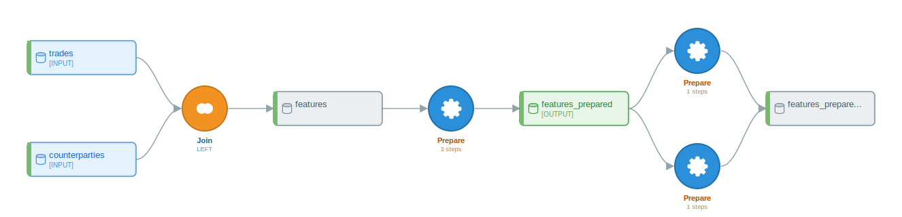
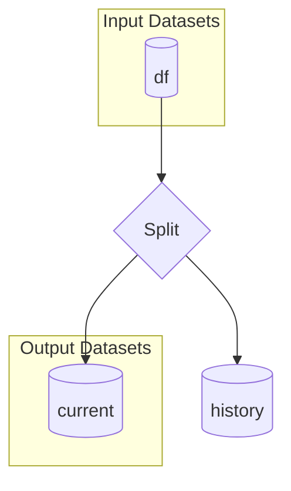

# Examples 03 — Counterparty Features and Forward-Curve Versioning

## What you'll learn

This chapter walks two end-to-end conversions in the front-office commodity-trading domain. The first builds a counterparty-default feature set for a credit-risk model from a trade ledger joined to a counterparty master, exercising a long [PREPARE](appendix-a-glossary.md#processor) chain (`FillEmptyWithValue`, `Binner`, `CategoricalEncoder`, `RemoveRowsOnEmpty`), a binary [JOIN](appendix-a-glossary.md#join) [recipe](appendix-a-glossary.md#recipe), and a [GREL](appendix-a-glossary.md#grel) formula derived from `assign(...)`. The second handles a forward-curve slowly-changing-dimension table — splitting current quotes from historical ones via the canonical `cond` / `~cond` shape — and confirms that py-iku consolidates it into exactly one [SPLIT](appendix-a-glossary.md#split) recipe with two outputs, matching the ground truth in Chapter 9.

Both examples use only the public API (`convert`, `DataikuFlow`). Both verify the produced flow by enumerating recipes and steps; neither asserts on cosmetic details (recipe names, dataset names) that the rule-based naming pass owns.

## Why these two

The chapter pairs two patterns that show up constantly on a commodities trading desk and that exercise complementary parts of py-iku:

- A *flow-shape* pattern: a counterparty feature pipeline with one input join, several PREPARE steps, and a final feature [dataset](appendix-a-glossary.md#dataset). It shows how `assign(...)` becomes a `CreateColumnWithGREL` step, how `pd.qcut` becomes a `Binner` [processor](appendix-a-glossary.md#processor), and how `pd.get_dummies` becomes a `CategoricalEncoder` processor.
- A *structural-inference* pattern: a forward-curve SCD router that uses an explicit `cond = ...` followed by `df[cond]` and `df[~cond]`. Chapter 9 documents this as the only filter shape the rule-based detector consolidates today; this chapter verifies the consolidation against `convert()`.

Neither script writes to a [partition](appendix-a-glossary.md#partition) key, neither sets a connection. The intent is not to make these scripts production-shaped but to give a reader two concrete pandas-to-flow conversions whose every output is traceable back to a line of source.

## Example 1 — Counterparty default-prediction features

### Schema

The example uses two inputs that match common front-office credit-risk shapes. Both are declared here once because they are out-of-running-example schemas (the running example uses `orders` / `customers` / `products`):

- `trades.csv` — `trade_id`, `trader_id`, `trade_date`, `value_date`, `counterparty_id`, `instrument` (e.g. `WTI-DEC25`), `commodity` (`CRUDE` / `NATGAS` / `POWER`), `notional`, `price`, `currency`, `buy_sell`, `book`, `region`, `delivery_location`, `booked_at`.
- `counterparty_master.csv` — `counterparty_id`, `name`, `country`, `credit_rating` (`AAA` / `AA` / `A` / `BBB` / `BB` / `B` / `CCC` / `D` / `NR`), `exposure_limit` (USD), `current_exposure` (USD), `master_agreement` (`ISDA` / `NAESB` / `EFET` / `GTMA` / `OTHER`), `last_review_date`, `watch_list_flag` (`Y` / `N`).

The pipeline merges trades to their counterparty record on `counterparty_id`, derives a `days_since_last_trade` feature against a hardcoded reference date, fills missing `credit_rating` values with `"NR"` (the standard not-rated code), bins `current_exposure` into five quantile buckets `Q1`..`Q5`, one-hot-encodes `credit_rating`, drops rows whose `days_since_last_trade` is null, and writes the resulting feature set as Parquet.

### Source

```python
import pandas as pd
from py2dataiku import convert

source = """
import pandas as pd
trades = pd.read_csv("trades.csv")
counterparties = pd.read_csv("counterparty_master.csv")
features = trades.merge(counterparties, on="counterparty_id", how="left")
features = features.assign(days_since_last_trade=lambda x: x["trade_date"] - "2026-04-26")
features["credit_rating"] = features["credit_rating"].fillna("NR")
features["exposure_bucket"] = pd.qcut(features["current_exposure"], q=5, labels=["Q1", "Q2", "Q3", "Q4", "Q5"])
features = pd.get_dummies(features, columns=["credit_rating"])
features = features.dropna(subset=["days_since_last_trade"])
features.to_parquet("counterparty_features.parquet")
"""
flow = convert(source)
```

The reference date is hardcoded as a string (`"2026-04-26"`) rather than computed via `pd.Timestamp("today")`. The rule-based analyzer compiles the lambda body verbatim into a GREL expression — anything inside the lambda becomes the GREL formula, so a string subtraction is what the produced step records. A DSS engineer importing this flow would replace the right-hand-side with the GREL idiom `dateDiff(today(), val("trade_date"), "days")` before running the recipe.

### Convert

The rule-based analyzer produces four recipes for this script:

```python
print(len(flow.recipes))  # 4
print([r.recipe_type.value for r in flow.recipes])
# ['join', 'prepare', 'prepare', 'prepare']
print(len(flow.datasets))  # 5
```

One JOIN (the `merge`) and three PREPARE recipes covering the seven element-wise transformations in the script. The PREPAREs do not collapse into a single PREPARE because `pd.get_dummies(features, columns=["credit_rating"])` and the bare-assignment `features["exposure_bucket"] = pd.qcut(...)` are emitted as siblings against the same intermediate dataset rather than as a linear chain — the [optimizer](appendix-a-glossary.md#optimizer)'s PREPARE-merge rule is fan-out aware (see Chapter 10) and refuses to merge across the branch.

### Inspect every PrepareStep

Walk the recipes and print the processor type plus the params that drive the DSS step:

```python
for r in flow.recipes:
    if r.recipe_type.value != "prepare":
        continue
    print(f"recipe={r.name} input={r.inputs} output={r.outputs}")
    for i, s in enumerate(r.steps):
        print(f"  [{i}] {s.processor_type.value}: {s.params}")
```

Running that on the produced flow prints five PREPARE steps in total, distributed across the three PREPARE recipes:

```text
recipe=prepare_2 input=['features'] output=['features_prepared']
  [0] RemoveRowsOnEmpty: {'columns': ['days_since_last_trade'], 'keep': False}
  [1] CreateColumnWithGREL: {'column': 'days_since_last_trade', 'expression': "x['trade_date'] - '2026-04-26'"}
  [2] CategoricalEncoder: {'columns': ['credit_rating'], 'encoding': 'one_hot'}
recipe=prepare_3 input=['features_prepared'] output=['features_prepared_prepared']
  [0] FillEmptyWithValue: {'column': 'credit_rating', 'value': 'NR'}
recipe=prepare_4 input=['features_prepared'] output=['features_prepared_prepared']
  [0] Binner: {'column': 'current_exposure', 'output_column': "features['exposure_bucket']", 'bins': 5, 'mode': 'qcut'}
```

Four observations are worth pinning down before treating this output as canonical:

- The `assign(days_since_last_trade=lambda x: x["trade_date"] - "2026-04-26")` lambda compiles to a `CreateColumnWithGREL` step with the GREL expression literally tracking the lambda body. Chapter 9 covers the GREL compilation antecedent.
- `pd.qcut(features["current_exposure"], q=5, labels=["Q1", "Q2", "Q3", "Q4", "Q5"])` becomes a `Binner` processor with `bins=5` and `mode='qcut'`. The `labels=[...]` keyword is silently dropped by the rule-based analyzer — the produced step does not carry the bucket names. A reader who needs `Q1`..`Q5` labels in the output column must add a follow-on `ColumnRenamer` step in DSS, or use the LLM path (Chapter 7), which preserves the label list. This is a documented gap in the rule-based analyzer rather than a bug.
- The Binner's `output_column` is recorded as `features['exposure_bucket']` because the assignment target is a subscript expression; downstream consumers should rename the column or use the Binner's own output-column setting before the next recipe.
- `pd.get_dummies(features, columns=["credit_rating"])` becomes a `CategoricalEncoder` step with `encoding='one_hot'`. The encoder is recorded against the same recipe as `RemoveRowsOnEmpty` (the `dropna`) because both transformations are bare-assignment-style updates to `features` that the PREPARE buffer flushes together.

### Inspect the DAG with `flow.graph`

The graph accessor exposes the dataset-and-recipe DAG that DSS will see. Look at the predecessors of each output dataset to confirm the [lineage](appendix-a-glossary.md#lineage):

```python
g = flow.graph
print(g.get_predecessors("features"))
# ['recipe:join_1']
print(g.get_predecessors("features_prepared"))
# ['recipe:prepare_2']
print(g.get_predecessors("features_prepared_prepared"))
# ['recipe:prepare_3', 'recipe:prepare_4']
```

The third call signals the fan-in: two PREPARE recipes both write to the same downstream dataset name. Reading the lineage bottom-up, `features_prepared_prepared` has two upstream recipes, which is the visible signature of a non-linear DAG inside what looks superficially like a one-line pipeline. A reader who wanted a single linear PREPARE chain here would either rewrite the source so each PREPARE-eligible operation is a method-chain call on the previous binding (so the optimizer sees a linear path), or delegate to the LLM path (Chapter 7), which interprets the script's *intent* rather than its AST shape.

### Visualize

Three render formats, each useful in a different setting:

```python
print(flow.visualize(format="ascii"))
print(flow.visualize(format="mermaid"))
svg = flow.visualize(format="svg")
```

The ASCII render prints a vertical text-art DAG with the two input datasets at the top (`trades` and `counterparties`, both tagged `[INPUT]`), the JOIN node, the intermediate `features` dataset, the first PREPARE (`3 steps`), the intermediate `features_prepared` dataset (tagged `[OUTPUT]` because it sits on the path to a terminal node), and then the two parallel PREPAREs writing into `features_prepared_prepared`. The vertical layout is enough to confirm at a glance that two PREPAREs share an output dataset.

The Mermaid render is the format that lives inside Markdown-rendered docs:

```mermaid
flowchart TD
    subgraph inputs[Input Datasets]
        D0[(trades)]
        D1[(counterparties)]
    end
    subgraph outputs[Output Datasets]
        D3[(features_prepared)]
    end
    D2[(features)]
    D4[(features_prepared_prepared)]
    R0{Join (LEFT)}
    R1{Prepare (3 steps)}
    R2{Prepare (1 steps)}
    R3{Prepare (1 steps)}
    D0 --> R0
    D1 --> R0
    R0 --> D2
    D2 --> R1
    R1 --> D3
    D3 --> R2
    R2 --> D4
    D3 --> R3
    R3 --> D4
```

The SVG render is the high-resolution form; the asset is committed alongside this chapter:



Three different formats of the same flow object — the ASCII for terminal pipelines, the Mermaid for inline doc rendering, and the SVG for design reviews and slides.

## Example 2 — Forward-curve SCD router

### Schema

A single input that mirrors the canonical SCD-Type-2 shape commodity desks use to version forward curves:

- `curve_history.csv` — `commodity` (e.g. `CRUDE`, `NATGAS`, `POWER`), `tenor` (e.g. `CAL26`, `Q1-2026`), `delivery_location` (e.g. `WTI-Cushing`, `HenryHub`, `PJM-W`), `mid_price`, `bid`, `ask`, `currency`, `effective_date`, `end_date`.

Each row in `curve_history.csv` represents a quote for a `(commodity, tenor, delivery_location)` triple at a point in time. `effective_date` and `end_date` bound the validity window; an `end_date` of `None` means the quote is current. Given a reference date, every row is either current or historical. The script writes the current rows to one output and the historical rows to another.

### Source

```python
import pandas as pd
from py2dataiku import convert

source = """
import pandas as pd
ref_date = "2026-04-26"
df = pd.read_csv("curve_history.csv")
cond = (df["effective_date"] <= ref_date) & ((df["end_date"].isna()) | (df["end_date"] > ref_date))
current = df[cond]
history = df[~cond]
current.to_parquet("curves_current.parquet")
history.to_parquet("curves_history.parquet")
"""
flow = convert(source)
```

The two filters use the canonical complementary form: an explicit `cond = ...` binding, then `df[cond]` and `df[~cond]`. Chapter 9 establishes that this is the only filter shape the rule-based detector consolidates today — `df[df.x > N]` against `df[df.x < N]` is *mathematically* complementary but not *syntactically* complementary, so it stays as two single-output SPLITs.

### Verify the SPLIT consolidation

The structural assertion the example exists to check:

```python
print(len(flow.recipes))                     # 1
print([r.recipe_type.value for r in flow.recipes])
# ['split']

splits = [r for r in flow.recipes if r.recipe_type.value == "split"]
print(len(splits))                           # 1
print(splits[0].outputs)
# ['current', 'history']
print(splits[0].inputs)
# ['df']
print(splits[0].split_condition)
# cond
```

One recipe, a SPLIT, with exactly two outputs named `current` and `history` — matching the assignment targets in the source — and a single input `df`. The recipe's `split_condition` field carries the predicate name (`cond`) verbatim from the source binding. This is the canonical 1→2 SPLIT shape Chapter 9 promises for the `cond` / `~cond` form. There is no upstream PREPARE recipe in this run because the script does not derive any new columns before the split — the rule-based analyzer only emits a PREPARE when an `assign(...)` or bare-assignment column derivation precedes the filter.

### Inspect the DAG

```python
g = flow.graph
print(g.get_predecessors("current"))
# ['recipe:split_1']
print(g.get_predecessors("history"))
# ['recipe:split_1']
print(g.get_predecessors("df"))
# []
```

Both `current` and `history` are predecessors of the same recipe: `split_1`. That is the structural property that distinguishes the consolidated form from the two-single-output-SPLIT form Chapter 9 cautions against. A downstream cache-invalidation pass that walks `g.get_predecessors(...)` for each output sees one upstream recipe rather than two, which is precisely the operationally relevant property called out in Chapter 9's "Why a single SPLIT is the right shape" section.

If a future regression broke this consolidation — producing two `split` recipes instead of one — `len([r for r in flow.recipes if r.recipe_type.value == 'split']) == 1` would flip to `2`, and the two outputs would each have their own predecessor recipe. The assertion is the right place to catch that drift.

### Visualize

```python
print(flow.visualize(format="ascii"))
print(flow.visualize(format="mermaid"))
print(flow.visualize(format="plantuml"))
```

The ASCII output renders `df` at the top tagged `[INPUT]`, then the SPLIT recipe, then the two output datasets `current` (tagged `[OUTPUT]`) and `history` listed as the two children of the SPLIT — the visual signature of the 1→2 consolidation.

The Mermaid render shows the two-output fan-out cleanly:



A single `R0` SPLIT node fans out to both `D1` (`current`) and `D2` (`history`). That is the topological signature Chapter 9 sets up as the right shape for SCD routing.

The PlantUML render is the format teams paste into Confluence and architecture documents:

```plantuml
@startuml
rectangle "df" <<input>> as df
rectangle "current" <<output>> as current
rectangle "history" <<intermediate>> as history

card "Split" <<split>> as recipe_0

df --> recipe_0
recipe_0 --> current
recipe_0 --> history
@enduml
```



The renderer's full output includes `skinparam` and stereotype-style blocks for node colouring; the snippet above is the structural core. Three formats — ASCII for terminal output, Mermaid for inline Markdown rendering, and PlantUML for tooling that prefers UML syntax — all of the same flow object, all derived from one `flow.visualize(...)` call per format.

## What these two examples leave out

The counterparty example does not exercise WINDOW (no rolling notional aggregations), GROUPING (no `groupby().agg(...)` over book or trader), or SORT. The forward-curve example does not exercise multi-tenor joins or compound formulas beyond the two-clause `&` predicate inside `cond`. Both gaps are deliberate: the chapter's purpose is to ground the reader in the recipe and processor types that front-office data pipelines hit most often, not to enumerate every conversion path. Chapter 6 is the recipe-types tour for readers who want a broader sweep.

Neither example writes to a partitioned dataset; partition keys for trade-date or curve-effective-date partitioning are handled in the LLM path (Chapter 7) and via dataset metadata not exercised here. Neither example exercises the LLM analyzer; both round-trip through the rule-based path that Chapter 9 specifies.

## Further reading

- [Glossary](appendix-a-glossary.md) — the SPLIT, recipe, processor, dataset, GREL, partition, lineage, optimizer, and JOIN entries used here.
- [Cheatsheet](appendix-c-cheatsheet.md) — pandas-to-DSS lookup for the processors used in Example 1.
- [Chapter 8: Filters and predicates](08-filters-and-predicates.md) — the conservative-failure rule that routes equality, range, and compound predicates to distinct `Filter*` processors.
- [Chapter 9: Advanced patterns](09-advanced-patterns.md) — the complementary-filter detection rule that Example 2 verifies, and the GREL compilation rule that Example 1 exercises.
- [Chapter 12: Extending py-iku](12-extending-py-iku.md) — the plugin path for sklearn-style transformers (e.g. a custom credit-rating ordinal encoder) that the core library deliberately does not handle.
- [Notebook 03: advanced patterns](https://github.com/m-deane/py-iku/blob/main/notebooks/03_advanced.ipynb) — exercises the same SPLIT consolidation against a different schema.
- [Models API reference](../api/models.md) — `DataikuFlow`, `DataikuRecipe`, `PrepareStep`.

## What's next

Subsequent worked-examples chapters take the same convert-inspect-visualize loop into adjacent domains; readers who finished this chapter and want a broader recipe-type sweep should turn to Chapter 6.
