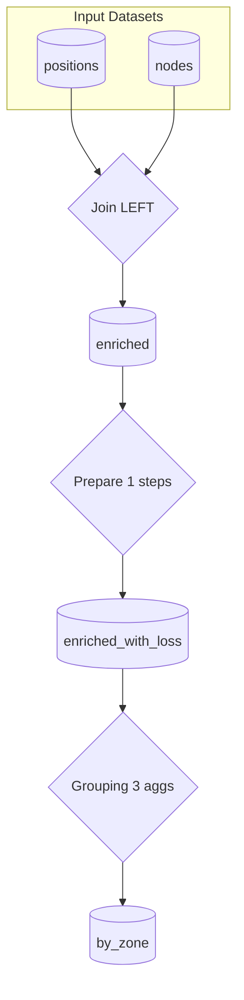
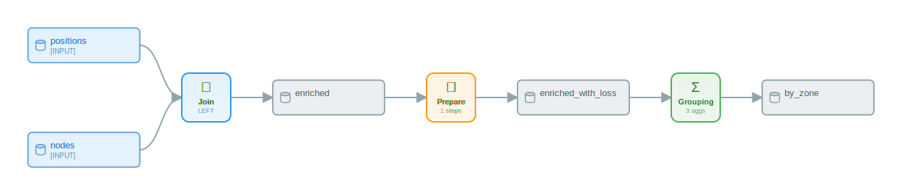
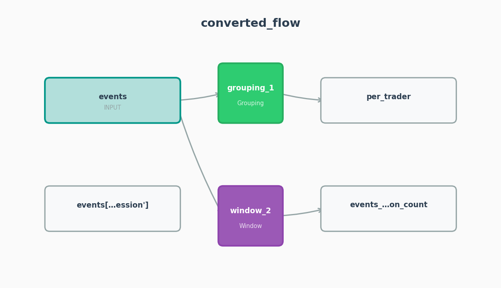

# Worked Examples 4 — Power Hubs and Trade-Event Aggregation

## What you'll learn

This chapter walks two front-office trading scripts end-to-end through `convert()` and inspects the resulting flows in full. The first joins PJM locational positions to a node-zone reference table, derives a per-position transmission-loss metric with a [GREL](appendix-a-glossary.md#grel) formula, and aggregates by zone and delivery hour with a [GROUPING](appendix-a-glossary.md#recipetype) [recipe](appendix-a-glossary.md#recipe). The second processes a real-time trade-event stream from `Endur` and `Allegro` source systems, computes per-trader event counts with a `COUNTD` [aggregation](appendix-a-glossary.md#aggregation), and adds a session-bound rolling event count via a [WINDOW](appendix-a-glossary.md#window) recipe. Both examples surface gaps in the rule-based mapping table that a reader running py-iku against locational MtM and trade-capture pipelines will hit on day one.

## A note on coverage gaps

Three known gaps in the rule-based path are exercised by this chapter:

- `FUZZY_JOIN` has no pandas-mapping entry. Searching `py2dataiku/mappings/pandas_mappings.py` for `fuzzy` returns nothing; `df.merge(...)` always lands on `RecipeType.JOIN` regardless of column-content fuzziness.
- `SYNC` has no pandas-mapping entry either. A `df.to_csv(...)` is recorded as a write side-effect but never promoted to a `SYNC` recipe. Constructing a `SYNC` recipe requires the manual route shown later.
- A `groupby(...).rolling(..., on=...)` chain returns empty `partition_columns` and `order_columns` on the rule-based path. The window-emission code in `py2dataiku/parser/ast_analyzer.py:441-503` extracts the window size and aggregation column from the chain but does not populate partition or order keys; `py2dataiku/generators/flow_generator.py:714-715` then reads those parameters back as empty lists.

Each gap is called out where it surfaces. Both rule-based examples close the gap by editing the produced [DataikuFlow](appendix-a-glossary.md#dataset) directly using the public API.

## Example 1 — PJM hub-locational MtM analysis

### Schema

> Out-of-running-example. `lmp_positions.csv` carries one row per locational position with `position_id`, `trader_id`, `trade_date`, `iso`, `node_id`, `node_name`, `zone`, `volume_mwh`, `position_type` (`LONG` / `SHORT`), `source_lmp` ($/MWh), `dest_lmp` ($/MWh), `delivery_date`, `hour_ending`. `node_to_zone.csv` carries one row per PJM pricing node with `node_id`, `node_name`, `zone`, `lat`, `lon`, `voltage_kv`, `region`. Common PJM zones in the data: `WESTERN HUB`, `AEP`, `DOM`, `AECO`, `ComEd`.

### Source

```python
from py2dataiku import convert

source = """
import pandas as pd

positions = pd.read_csv("lmp_positions.csv")
nodes = pd.read_csv("node_to_zone.csv")

enriched = positions.merge(
    nodes,
    on="node_id",
    how="left",
)

by_zone = enriched.groupby(["zone", "hour_ending"]).agg({
    "volume_mwh": "sum",
    "position_id": "count",
})
"""
flow = convert(source)
```

### Initial flow shape

The rule-based analyzer produces two recipes:

```
join       ['positions', 'nodes'] -> ['enriched']
grouping   ['enriched'] -> ['by_zone']
```

The merge becomes a [JOIN](appendix-a-glossary.md#join) recipe with `JoinType.LEFT` and one join key on `node_id`. The `groupby(...).agg({...})` form (a dictionary, not a named-tuple) becomes a `GROUPING` recipe with `group_keys=['zone', 'hour_ending']` and two aggregations. Inspecting the JOIN node confirms the keys and join type:

```python
from py2dataiku import RecipeType

join = next(r for r in flow.recipes if r.recipe_type == RecipeType.JOIN)
print(join.join_type.value)               # 'LEFT'
for jk in join.join_keys:
    print(jk.left_column, jk.right_column, jk.match_type)
# node_id node_id EXACT
```

The match type is `EXACT`. There is no fuzzy matching here even though front-office data frequently carries node-name variants (`"AEP-DAYTON HUB"` vs `"AEP DAYTON"`); see the gap note below.

### FUZZY_JOIN: the routing gap

Trading desks running locational analysis often need fuzzy matches against a master node table — partial node-name matches across vendor feeds, ISO renamings, or upstream tickers. `RecipeType.FUZZYJOIN` exists in py-iku, but `mappings/pandas_mappings.py` carries no rule that promotes any pandas idiom to it (`grep -i fuzzy py2dataiku/mappings/pandas_mappings.py` returns no matches). The analyzer cannot infer fuzziness from the AST alone; the join is `node_id`-keyed in the source, and the analyzer treats it as exact. For a one-off conversion against a dirty node table, edit the produced recipe in place: `join.recipe_type = RecipeType.FUZZYJOIN`. The serializer respects the change. Chapter 12 walks through the [plugin](appendix-a-glossary.md#mapping-rule) route for teams that want a sentinel marker (a comment, a wrapper function) to promote selected merges to `FUZZY_JOIN`.

### Adding the transmission-loss GREL formula

The rule-based analyzer does not promote bare-assignment derived columns such as `enriched["transmission_loss"] = (enriched["source_lmp"] - enriched["dest_lmp"]) * enriched["volume_mwh"]` to a PREPARE recipe. The `_handle_assign` path in `py2dataiku/parser/ast_analyzer.py:235-249` groups transformations by their target dataframe name, and a subscript target like `enriched["transmission_loss"]` is keyed under the literal string `enriched['transmission_loss']` — not under `enriched`. The COLUMN_CREATE transformation is recorded but never paired with a READ_DATA or upstream `source_dataframe`, so `flow_generator.py:77-100` drops the group on the floor. The fix is to construct the PREPARE recipe directly:

```python
from py2dataiku import (
    DataikuRecipe, RecipeType, ProcessorType, PrepareStep,
    DataikuDataset, DatasetType, Aggregation,
)

grel = (
    '(val("source_lmp") - val("dest_lmp")) * val("volume_mwh")'
)

loss_step = PrepareStep(
    processor_type=ProcessorType.CREATE_COLUMN_WITH_GREL,
    params={"column": "transmission_loss", "expression": grel},
)
prep = DataikuRecipe(
    name="prepare_loss",
    recipe_type=RecipeType.PREPARE,
    inputs=["enriched"],
    outputs=["enriched_with_loss"],
    steps=[loss_step],
)
flow.recipes.insert(1, prep)
flow.add_dataset(DataikuDataset(
    name="enriched_with_loss",
    dataset_type=DatasetType.INTERMEDIATE,
))

grp = next(r for r in flow.recipes if r.recipe_type == RecipeType.GROUPING)
grp.inputs = ["enriched_with_loss"]
grp.aggregations.append(Aggregation(column="transmission_loss", function="AVG"))
```

The GREL string is a real DSS formula computing a per-position dollar value: spread between source and destination [LMP](appendix-a-glossary.md#dataset) multiplied by the position's volume. `val("source_lmp")` and `val("dest_lmp")` reference the position columns; `val("volume_mwh")` is the position size. The expression syntax is the standard formula language (see [Dataiku docs: Formula language](https://doc.dataiku.com/dss/latest/formula/index.html)).

### Inspecting every recipe's settings

After the manual edit, the recipe sequence is JOIN → PREPARE → GROUPING:

```python
for r in flow.recipes:
    print(f"{r.recipe_type.value:10s} {r.inputs} -> {r.outputs}")
# join       ['positions', 'nodes'] -> ['enriched']
# prepare    ['enriched'] -> ['enriched_with_loss']
# grouping   ['enriched_with_loss'] -> ['by_zone']
```

The PREPARE recipe is one `CreateColumnWithGREL` step. The GROUPING aggregations now read:

```
volume_mwh         -> SUM
position_id        -> COUNT
transmission_loss  -> AVG
```

The DAG is one connected component, which is what a reader expects from a linear enrichment-then-aggregate pipeline:

```python
print(flow.graph.find_disconnected_subgraphs())
# [{'positions', 'nodes', 'recipe:join_1', 'enriched',
#   'recipe:prepare_loss', 'enriched_with_loss',
#   'recipe:grouping_2', 'by_zone'}]
```

A single set means a single connected component. `find_disconnected_subgraphs()` returns more than one set when a recipe is unreachable from any input — Chapter 10 covers that diagnostic. `FlowGraph.get_path` traces a directed path from input to output, useful for asserting [lineage](appendix-a-glossary.md#lineage) in CI:

```python
print(flow.graph.get_path("positions", "by_zone"))
# ['positions', 'recipe:join_1', 'enriched',
#  'recipe:prepare_loss', 'enriched_with_loss',
#  'recipe:grouping_2', 'by_zone']
```

The path passes through the GREL-bearing PREPARE on its way from the position-tape input to the zonal MtM output.

### Visualization: ASCII

`flow.visualize(format="ascii")` returns a vertical text-art DAG (the renderer uses framed boxes and the literal `📊` glyph for [dataset](appendix-a-glossary.md#dataset) nodes; the raw output is meant for terminal viewing rather than for embedding in prose). Reading top-to-bottom, the renderer prints `positions` and `nodes` as `[INPUT]` boxes feeding the `⋈ JOIN` recipe (labelled `LEFT`), an intermediate `enriched` dataset, the `⚙ PREPARE` recipe (`1 steps`), an intermediate `enriched_with_loss` dataset, the `Σ GROUPING` recipe (`3 aggs`), and a terminal `by_zone` dataset. The format is enough to confirm at a glance that the JOIN, PREPARE, and GROUPING are wired in series with no branching.

### Visualization: Mermaid



### Visualization: SVG

`flow.save("docs/textbook/assets/power-hubs-1.svg")` writes the canonical SVG render. The same image is embedded below.



## Example 2 — Real-time trade-event aggregation per trader

### Schema

> Out-of-running-example. `trade_events.csv` carries one row per trade-lifecycle event from a desk's order-and-execution stack: `event_id`, `trade_id`, `trader_id`, `event_type` (`BOOKED` / `AMENDED` / `CANCELLED` / `MATCHED` / `SETTLED`), `event_at` (timestamp), `source_system` (`Endur` / `Allegro` / `Internal` / `Exchange`), `session_id`, `instrument`, `region`. One trade typically appears on five to ten event rows over its lifecycle; one trader produces hundreds to thousands of events per session.

### Source

```python
from py2dataiku import convert

source = """
import pandas as pd

events = pd.read_csv("trade_events.csv")

per_trader = events.groupby("trader_id").agg({
    "trade_id": "nunique",
    "event_id": "count",
})

events["events_in_session"] = events["event_id"].rolling("1H").count()
"""
flow = convert(source)
```

The two assignments share an input. The rule-based analyzer recognises `groupby(...).agg(dict)` and `series.rolling(...).count()` as distinct operations and emits two recipes that both fan out from `events`:

```
grouping   ['events'] -> ['per_trader']
window     ['events'] -> ["events['events_in_session']"]
```

### GROUPING with COUNTD

`trade_id: "nunique"` becomes an aggregation of canonical type `COUNTD` (count distinct). `AggregationFunction.NUNIQUE` is a phantom alias that points at the same canonical `COUNTD` value, so emitted JSON imports cleanly into DSS regardless of which alias the source used. `event_id: "count"` becomes `COUNT`. The full grouping spec:

```python
grp = next(r for r in flow.recipes if r.recipe_type.value == "grouping")
print(grp.group_keys)
# ['trader_id']
for a in grp.aggregations:
    print(a.column, a.function)
# trade_id COUNTD
# event_id COUNT
```

The two reductions answer two distinct desk questions: `trade_id COUNTD` is the number of distinct trades a trader touched; `event_id COUNT` is the total event volume for that trader, including amendments, cancels, and settles. The first is a header-level metric; the second is a workload metric.

A separate event-type breakdown — one count per event type, useful for surfacing cancel-heavy or amend-heavy traders — must be added by hand. The `agg(name=("col","func"))` named-tuple form would express this in pandas, but the rule-based analyzer returns an empty `aggregations` list for that idiom; `grp.aggregations` after a named-tuple `agg(...)` call comes back as `[]`. Use the dict form (`.agg({"col":"func"})`) for any group-by reduction the analyzer should pick up.

### WINDOW with rolling time

The rolling assignment becomes a `WINDOW` recipe. The analyzer extracts the window size (`"1H"`) and the aggregation column (`event_id`, `COUNT`), and records them in `window_aggregations`:

```python
win = next(r for r in flow.recipes if r.recipe_type.value == "window")
print(win.window_aggregations)
# [{'column': 'event_id', 'type': 'COUNT', 'windowSize': '1H'}]
print(win.partition_columns, win.order_columns)
# [] []
```

The `partition_columns` and `order_columns` lists come back empty. The rule-based path does not extract `partition` and `order` from a chained `groupby(...).rolling(..., on="event_at")` invocation — `py2dataiku/parser/ast_analyzer.py:441-503` only walks the rolling and aggregation methods; `flow_generator.py:714-715` reads back what is not there. The LLM path (Chapter 7) recovers both fields. For the rule-based path, fill them in by hand if the downstream DSS export requires partition-bound rolling:

```python
win.partition_columns = ["trader_id"]
win.order_columns = ["event_at"]
```

The output dataset name `events['events_in_session']` carries the bracket syntax from the source AST — the analyzer does not normalise it. A clean rename improves both downstream readability and PlantUML rendering (see the visualization note below):

```python
from py2dataiku import DataikuDataset, DatasetType

win.outputs = ["events_with_session_count"]
flow.add_dataset(DataikuDataset(
    name="events_with_session_count",
    dataset_type=DatasetType.INTERMEDIATE,
))
```

### Deriving event_intensity: the silent-drop gap

A natural follow-up — `events["event_intensity"] = events["events_in_session"] / events["session_duration_min"]` — is dropped silently by the rule-based analyzer. The reason is the same one that broke the GREL derivation in Example 1: `_handle_binop` (in `py2dataiku/parser/ast_analyzer.py:1770-1780`) records a `COLUMN_CREATE` transformation, but its `target_dataframe` is `events['event_intensity']` (the literal subscript), not `events`. The grouping logic at `flow_generator.py:77` keys transformations by `target_dataframe`, which puts the binop in its own group with no upstream dataset — the FlowGenerator then drops the group because there is nothing to write a PREPARE recipe against. Adding an `event_intensity` step requires the same hand-construction:

```python
intensity_step = PrepareStep(
    processor_type=ProcessorType.CREATE_COLUMN_WITH_GREL,
    params={
        "column": "event_intensity",
        "expression": 'val("events_in_session") / val("session_duration_min")',
    },
)
intensity_prep = DataikuRecipe(
    name="prepare_intensity",
    recipe_type=RecipeType.PREPARE,
    inputs=["events_with_session_count"],
    outputs=["events_scored"],
    steps=[intensity_step],
)
flow.recipes.append(intensity_prep)
flow.add_dataset(DataikuDataset(
    name="events_scored",
    dataset_type=DatasetType.INTERMEDIATE,
))
```

### Inspecting the WINDOW settings and optimization notes

After the manual partition/order fix:

```python
print(win.partition_columns, win.order_columns)
# ['trader_id'] ['event_at']
print(win.window_aggregations)
# [{'column': 'event_id', 'type': 'COUNT', 'windowSize': '1H'}]
```

`flow.optimization_notes` collects per-recipe-type counts from the base generator and is appended to during merging by the [optimizer](appendix-a-glossary.md#optimizer). After `convert()` returns:

```python
for n in flow.optimization_notes:
    print(n)
# grouping: 1 recipe(s)
# window: 1 recipe(s)
```

The two PREPARE recipes added after the fact are absent from `optimization_notes` — the field records what the generator and optimizer saw at conversion time, not the post-edit shape. Append manual notes if downstream tooling reads the field for inventory:

```python
flow.optimization_notes.append("prepare: 1 recipe(s) [manual: intensity]")
```

### Visualization: ASCII

`flow.visualize(format="ascii")` prints `events` as the single `[INPUT]` box with the `Σ GROUPING` (`2 aggs`) and `▦ WINDOW` recipes both fanning out from it, then their respective intermediate datasets `per_trader` and `events_with_session_count`, and finally the `⚙ PREPARE` (`1 steps`) feeding `events_scored`. The renderer uses the literal `📊` glyph for datasets and `Σ` / `▦` / `⚙` for the recipe types — useful in a terminal but not embedded here.

### Visualization: PlantUML

```plantuml
@startuml
!theme plain

rectangle "events" <<input>> as events
rectangle "per_trader" <<intermediate>> as per_trader
rectangle "events_with_session_count" <<intermediate>> as events_with_session_count
rectangle "events_scored" <<intermediate>> as events_scored

card "Grouping" <<grouping>> as recipe_0
card "Window" <<window>> as recipe_1
card "Prepare" <<prepare>> as recipe_2

events --> recipe_0
recipe_0 --> per_trader
events --> recipe_1
recipe_1 --> events_with_session_count
events_with_session_count --> recipe_2
recipe_2 --> events_scored
@enduml
```



The aliases here have been chosen to be bracketless. The native `flow.visualize(format="plantuml")` output retains the bracket form verbatim when the rolling output is left at its analyzer-emitted name (`as events['events_in_session']`), which is invalid PlantUML — square brackets and quotes are reserved characters in alias positions. The renamed output (`events_with_session_count`) avoids the issue. Tracked as a visualizer quirk; the SVG, PNG, and ASCII outputs are unaffected.

### Visualization: PNG

`flow.save("docs/textbook/assets/power-hubs-2.png")` writes the matplotlib-rendered PNG. The same image is embedded below.



## What both examples illustrate

The rule-based analyzer is precise about idioms it knows and silent about idioms it does not. `df.merge`, `df.groupby(...).agg(dict)`, and `series.rolling(...).count()` all map cleanly. `df.merge` with fuzzy-key intent, `df["new"] = expression` (binop or scalar formula), `df.groupby(...).agg(name=(...))` (the named-tuple form), and `df.to_csv(...)` either route to the wrong recipe type, drop the operation on the floor, or both. Closing those gaps is the job of one of three escape hatches:

1. **The LLM path** (Chapter 7) recovers many of these by reading the intent of the code rather than the AST shape; in particular it recovers `partition_columns` and `order_columns` for the chained `groupby(...).rolling(...)` form.
2. **A registered plugin** (Chapter 12) extends `pandas_mappings.py` with team-specific rules — for instance, promoting any merge tagged with a sentinel comment to `FUZZY_JOIN`.
3. **Direct construction** on the produced `DataikuFlow`, as both examples here demonstrate.

The third option is the lightest weight when a single conversion needs a recipe type or processor the analyzer cannot infer. The `DataikuFlow`, `DataikuRecipe`, and `PrepareStep` constructors are public API and round-trip through `flow.to_dict() / from_dict()`, so a manually augmented flow serialises identically to a fully analyzer-generated one.

## Further reading

- [Glossary](appendix-a-glossary.md) — JOIN, GROUPING, WINDOW, GREL, aggregation, partition, dataset, recipe, processor, DSS.
- [Cheatsheet](appendix-c-cheatsheet.md) — the pandas-to-DSS lookup table for the merge, groupby, and rolling idioms used here.
- [Chapter 6: Recipe types tour](06-recipe-types-tour.md) — the full inventory of non-PREPARE recipe types, including `FUZZY_JOIN` and `SYNC` which this chapter constructs by hand.
- [Recipes API reference](../api/models.md) — `DataikuRecipe`, `DataikuFlow`, `PrepareStep`, `Aggregation`.
- [Notebook 03: advanced recipes](https://github.com/m-deane/py-iku/blob/main/notebooks/03_advanced.ipynb) — the same JOIN-PREPARE-GROUPING and rolling-WINDOW shapes against a different schema.
- [Dataiku docs: Formula language](https://doc.dataiku.com/dss/latest/formula/index.html) — GREL reference cited by the transmission-loss derivation.

## What's next

The next worked-examples chapter pairs prediction-scoring flows with the LLM analyzer path; readers staying on the rule-based path can return to Chapter 9 for advanced detection patterns.
